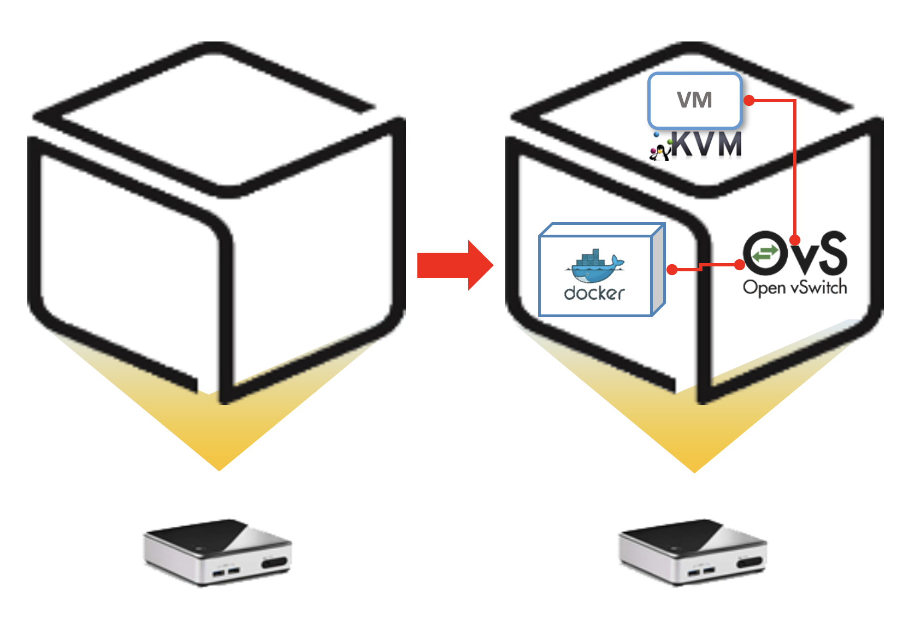
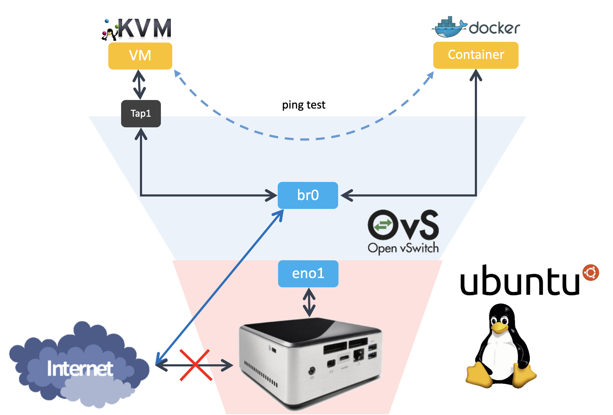
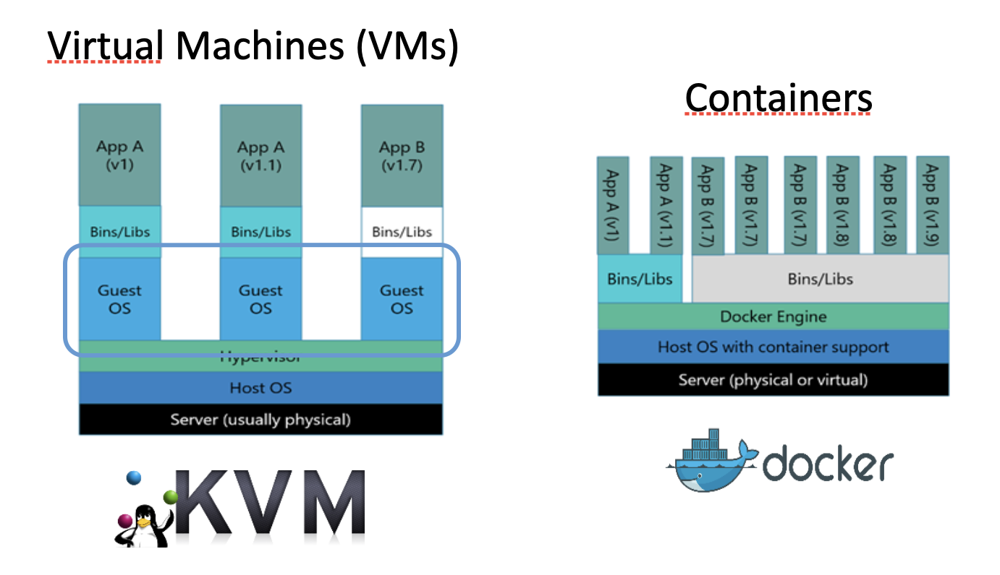
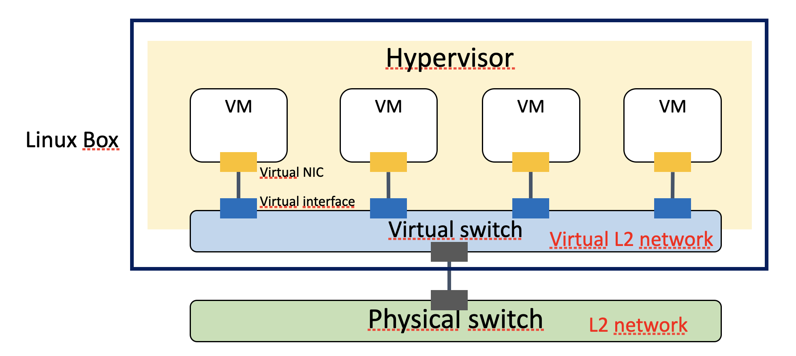
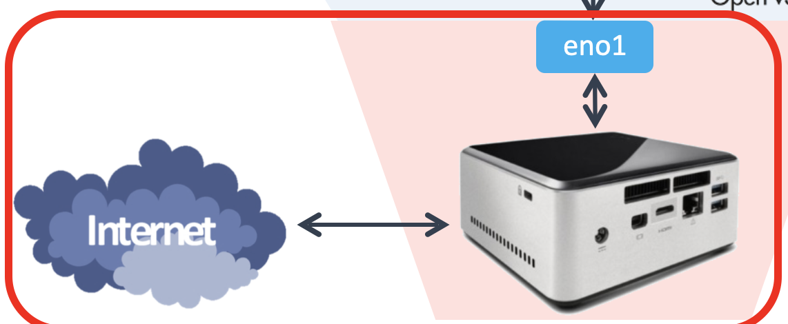
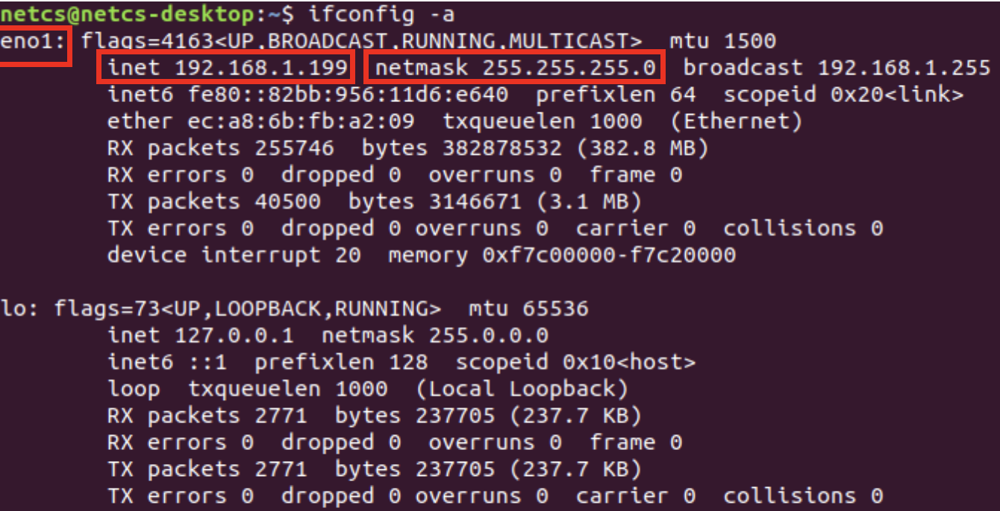
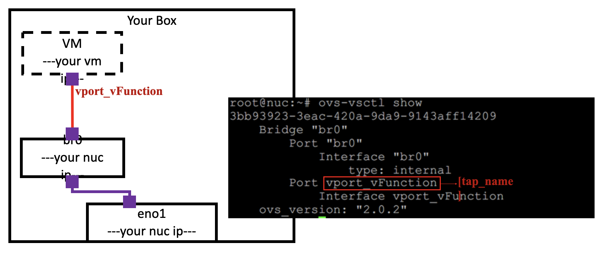
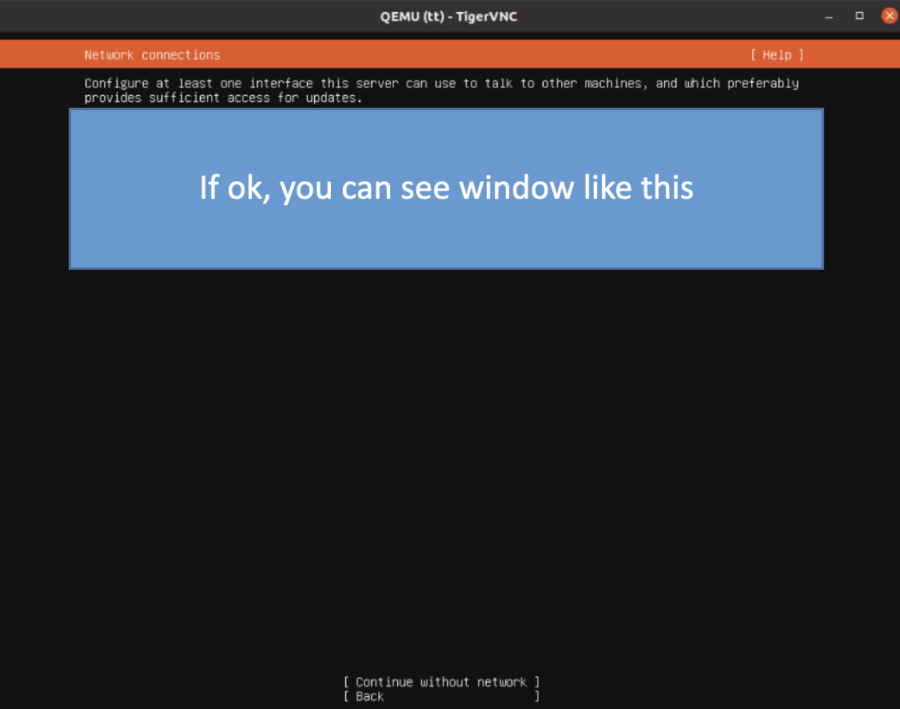
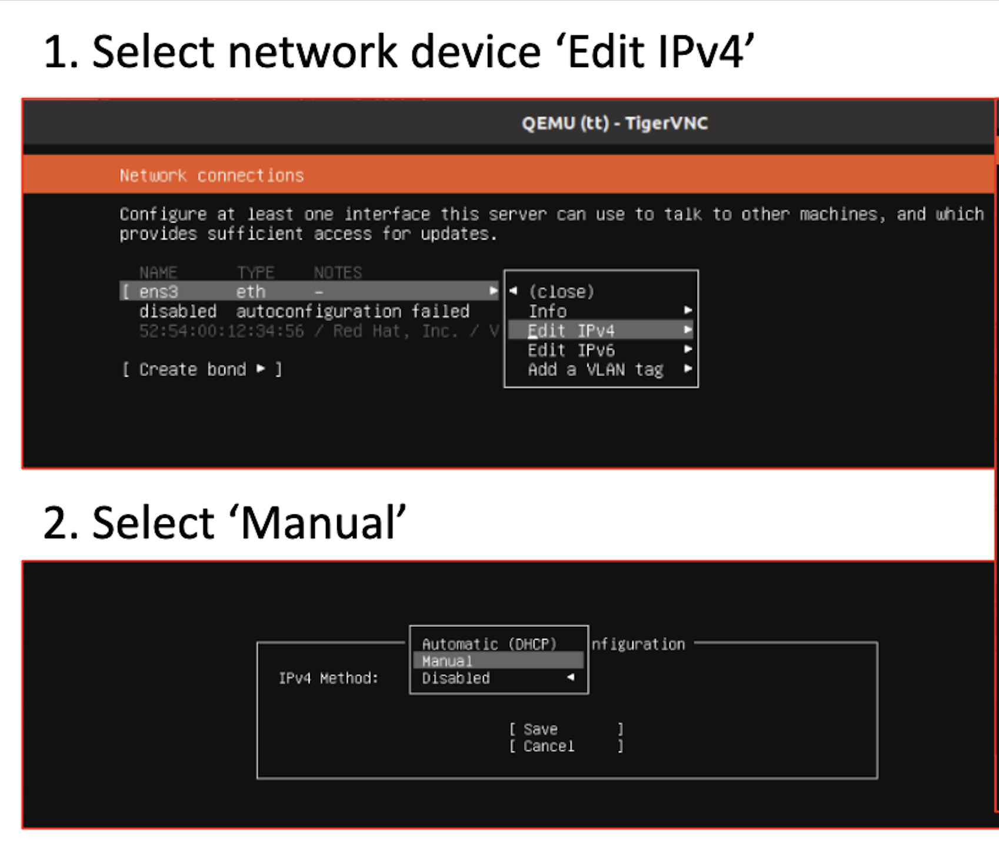
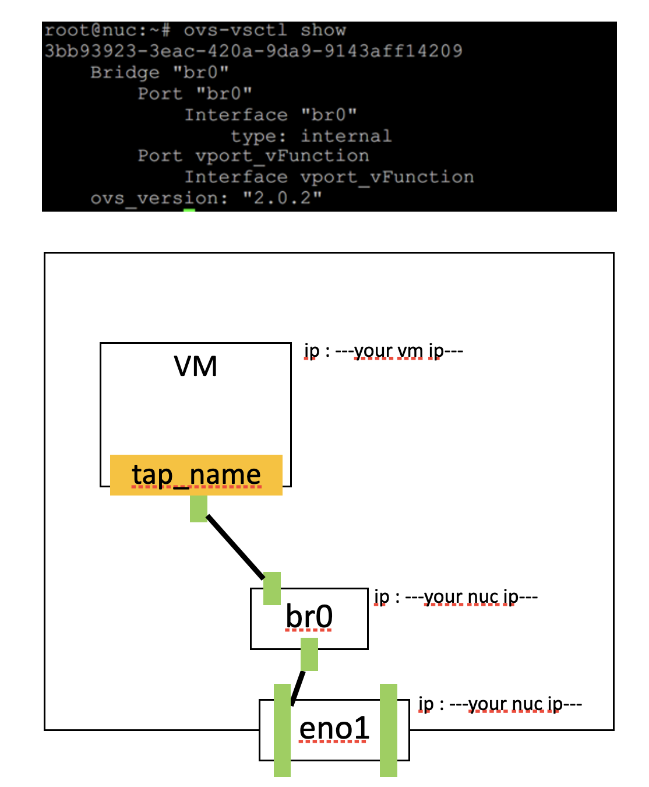

# Lab#1. Box Lab

## 0. Objective



Box Lab에서는 \*베어 메탈에 os를 직접 설치해보고  
이 안에 가상 머신과 컨테이너를 띄운 뒤 가상 스위치로 서로를 연결시켜보는 것입니다.

\*베어 메탈: 하드웨어 상에 어떤 소프트웨어도 설치되어 있지 않은 상태



세부적인 구조를 보면 다음과 같습니다.

## 1. Theory



- KVM Hypervisor => Virtual Machine

  하나의 피지컬 머신을 여러개의 가상 머신으로 나눌 것입니다. 각각의 가상 머신은 모두 독립적이며 개별적인 자원을 할당받습니다. 또한, 피지컬 머신의 OS와 다른 OS를 사용자 마음대로 정할 수 있습니다. 가상 머신은 피지컬 머신과 비교할 때 차이가 거의 없지만, 그만큼 Container보다 무겁고 생성하는데 오래걸립니다.

  저희는 가상 머신을 생성하기 위해 리눅스에 기본적으로 탑재되어있는 KVM Hypervisor를 사용할 것입니다.

- Docker Runtime => Container

  가상 머신과 비교했을 때 Container의 가장 큰 특징은 OS층이 없다는 것입니다. Container는 가상 머신과 달리 피지컬 머신의 OS를 공유합니다. 그리고 가상 머신은 각각의 머신이 독립적이지만 Container는 그렇지 않습니다.

  Container를 생성하기 위해서 가장 널리 쓰이는 Docker Runtime을 사용할 것입니다.



- Open vSwitch => Virtual Switch

  가상 스위치는 OS안에서 실제 물리적인 스위치처럼 동작합니다. 이번 실습에서 Open vSwitch를 통해 가상 스위치를 구성할 것이고 이를 통해, 가상머신과 컨테이너를 연결할 것입니다.

  Open vSwitch 역시 linux에 기본적으로 포함돼있는 가상 스위치입니다.

  Open vSwitch is an open-source virtual switch software designed for virtual servers.

  A software-based virtual switch allows one VM to communicate with neighbor VMs as well as to connect to Internet (via physical switch).
  Software-based switches (running with the power of CPUs) are known to be more flexible/upgradable and benefited of virtualization (memory overcommit, page sharing, …)
  VMs (similarly containers) have logical (virtual) NIC with virtual Ethernet ports so that they can be plugged into the virtual interface (port) of virtual switches.

## 2. Practice

### 2-1. NUC: OS Installation

OS : Ubuntu Desktop 20.04 LTS(64bit)
Download Site : <https://releases.ubuntu.com/20.04/>
Installed on NUC

#### 2-1-1. Updates and other software

- Select ‘Minimal installation’

#### 2-1-2. Installation type

- Select ‘Something else’
- On /dev/sda or /dev/nvme0n1

  - (UEFI), add 512MB EFI partition
  - Add empty partition with 20GB (20480MB) (Select ‘do not use the partition’)
  - Add Etc4 partition on leave memory

- Select Boot loader

  - BIOS: Ext4 partition
  - UEFI: EFI partition

- LVM 관련 오류 발생 시

  1. 뒤로 이동하여, 첫 Installation type 화면으로 이동
  2. Erase disk 선택

     - advance 에서 None 선택

  3. 시간대 선택 화면까지 진행

  4. 여기서 뒤로 돌아가, 다시 첫 Installation type 화면으로 이동

  5. Something else 선택하여 정상 진행

- 설치 후 네트워크 설정

  우측 상단의 Wired Connection GUI 이용

### 2-2. NUC: Network Configuration

- ‘Temporary’ Network Configuration using GUI

  

- Click the LAN configuration icon.
  

- Enter the network info.
  (IP address, subnet mask, gateway)
  

- Set Prerequisites

  0. Update & Upgrade

     ```bash
     sudo apt update
     sudo apt upgrade
     ```

  1. Install net-tools & ifupdown

     ```bash
     sudo apt install net-tools ifupdown
     ifconfig -a
     ```

     

2. Install openvswitch-switch & make br0 bridge

   ```bash
   sudo apt intall openvswitch-switch
   sudo ovs-vsctl add-br br0
   sudo ovs-vsctl show
   ```

   

- Disable netplan

  ```bash
  sudo su # Enter superuser mod
  systemctl stop systemd-networkd.socket systemd-networkd networkd-dispatcher systemd-networkd-wait-online
  systemctl disable systemd-networkd.socket systemd-networkd networkd-dispatcher systemd-networkd-wait-online
  systemctl mask systemd-networkd.socket systemd-networkd networkd-dispatcher systemd-networkd-wait-online
  apt-get --assume-yes purge nplan netplan.io
  exit # Exit superuser mod
  ```

  

  ```bash
  sudo apt update
  sudo apt -y install net-tools ssh
  ```

- eno1 interface

  ```bash
  sudo vi /etc/systemd/resolved.conf
  ```

  > DNS 주소를 명시해주세요
  >
  > …
  >
  > DNS = 8.8.8.8 8.8.4.4
  >
  > …

- Network interface

  Open /etc/network/interfaces

  ```bash
  sudo vi /etc/network/interfaces
  ```

  Configure the network interface `vport_vFunction` is a tap interface and attach it to your VM.

  ```text
  auto lo
  iface lo inet loopback

  auto br0
  iface br0 inet static
      address <your nuc ip>
      netmask 255.255.255.0
      gateway <gateway ip>
      dns-nameservers 8.8.8.8

  auto eno1
  iface eno1 inet manual

  auto vport_vFunction
  iface vport_vFunction inet manual
      pre-up ip tuntap add vport_vFunction mode tap
      up ip link set dev vport_vFunction up
      post-down ip link del dev vport_vFunction
  ```

  ```bash
  sudo systemctl restart systemd-resolved.service
  sudo ifup eno1
  ```

We will make VM attaching vport_vFunction. You can think this tap as a NIC of VM.
Below is the figure you configurated so far



Restrart the whole interfaces 1

```bash
sudo su
systemctl unmask networking
systemctl enable networking
systemctl restart networking
```

add port ‘eno1’ and ‘vport_vFunction’ to ‘br0’

```bash
sudo ovs-vsctl add-port br0 eno1
sudo ovs-vsctl add-port br0 vport_vFunction
sudo ovs-vsctl show
```

Restrart the whole interfaces 2

```bash
systemctl unmask networking
systemctl enable networking
systemctl restart networking
exit
```

### 2-3. NUC: Making VM with KVM

- Install dependency to upgrade KVM

  Install dependency & download Ubuntu 20.04 64bit server image.

  ```bash
  sudo apt install qemu-kvm libvirt-daemon-system libvirt-clients bridge-utils
  # upgrade KVM
  # qemu is open-source emulator

  wget http://old-releases.ubuntu.com/releases/focal/ubuntu-20.04-beta-live-server-amd64.iso
  ```

  Now we are ready to make VM. So, continue the setting.

- Prepare for Ubuntu VM

  To Make a VM image, command format is

  ```bash
  sudo qemu-img create [img_name].img -f qcow2 [storage_capacity]
  ```

  ```bash
  sudo qemu-img create vFunction20.img -f qcow2 10G
  ```

  Boot VM image from Ubuntu iso file (띄어쓰기 주의!)

  ```bash
  sudo kvm -m [memory_capacity] -name [vm_name] \
  -smp cpus=[cpu_numbers],maxcpus= [maxcpu_numbers] \
  -device virtio-net-pci,netdev=net0 \
  -netdev tap,id=net0,ifname= [tap_name],script=no \
  -boot d [img_name].img \
  -cdrom ubuntu-20.04-beta-live-server-amd64.iso -vnc :[port_number] \
  -daemonize -monitor telnet:127.0.0.1:3010,server,nowait,ipv4
  ```

  ```bash
  sudo kvm -m 1024 -name tt -smp cpus=2,maxcpus=2 -device virtio-net-pci,netdev=net0 -netdev tap,id=net0,ifname=vport_vFunction,script=no -boot d vFunction20.img -cdrom ubuntu-20.04-beta-live-server-amd64.iso -vnc :5 -daemonize -monitor telnet:127.0.0.1:3010,server,nowait,ipv4
  ```

  Configure SNAT with iptables for VM network

  ```bash
  sudo iptables –A FORWARD –i eno1 –j ACCEPT
  sudo iptables –A FORWARD –o eno1 –j ACCEPT
  sudo iptables –t nat –A POSTROUTING –s 192.168.100.0/24 –o eno1 –j SNAT --to <Your ip address>
  ```

  ```bash
  vi /etc/sysctl.conf
  ```

  remove annotation sign

  > #net.ipv4.ip_forward=1  
  > →  
  > net.ipv4.ip_forward=1

  ```bash
  sysctl –p
  ```

- Install Ubuntu VM (control with ‘Enter key’ and ‘Arrow keys’)

  Install VNC viewer and see inside of VM

  ```bash
  sudo apt-get install tigervnc-viewer
  vncviewer localhost:5
  ```

  

- VM network configuration (control with ‘Enter key’ and ‘Arrow keys’)

  > select network device → Edit IPv4  
  > IPv4 Method → Manual
  >
  > subnet: 203.237.53.0/24  
  > Address: <your vm ip>  
  > Gateway: <gateway ip>  
  > Name Servers: 8.8.8.8

  

- Installation Completed (control with ‘Enter key’ and ‘Arrow keys’)

  When ‘installation completed’ message is shown, terminate the VM

  ```bash
  sudo killall -9 qemu-system-x86_64
  ```

  boot VM again (mac should be different from others).

  command format is

  ```bash
  sudo kvm -m [memory_capacity] -name [vm_name] \
  -smp cpus=[cpu_numbers],maxcpus= [maxcpu_numbers] \
  -device virtio-net-pci,netdev=net0 \
  -netdev tap,id=net0,ifname= [tap_name],script=no \
  -boot d [img_name].img \
  -cdrom ubuntu-20.04-beta-live-server-amd64.iso -vnc :[port_number] \
  -daemonize -monitor telnet:127.0.0.1:3010,server,nowait,ipv4
  ```

  ```bash
  sudo kvm -m 1024 -name tt -smp cpus=2,maxcpus=2 -device virtio-net-pci,netdev=net0 -netdev tap,id=net0,ifname=vport_vFunction,script=no -boot d vFunction20.img -cdrom ubuntu-20.04-beta-live-server-amd64.iso -vnc :5 -daemonize -monitor telnet:127.0.0.1:3010,server,nowait,ipv4
  ```

### 2-4. OVS connects with KVM

- Check situation

  ```bash
  ovs-vsctl show
  ```

  

### 2-5. NUC: Installing ssh in VM

- Don’t forget to install ssh in VM

  ```bash
  sudo apt update
  sudo apt install -y net-tools ssh
  ```

### 2-6. Install docker

Docker is a set of platform as a service (PaaS) products that use OS-level virtualization to deliver software in packages called containers. The service has both free and premium tiers. The software that hosts the containers is called Docker Engine. It was first started in 2013 and is developed by Docker, Inc.

Set up the repository

Install packages to allow apt to use a repository over HTTPS

```bash
sudo apt-get update
sudo apt-get install -y ca-certificates curl gnupg lsb-release
```

Add Docker's official GPG key

```bash
curl -fsSL https://download.docker.com/linux/ubuntu/gpg | sudo gpg --dearmor -o /usr/share/keyrings/docker-archive-keyring.gpg
```

Add the Docker apt repository

```bash
# For All NUCs
echo \
  "deb [arch=$(dpkg --print-architecture) signed-by=/usr/share/keyrings/docker-archive-keyring.gpg] https://download.docker.com/linux/ubuntu \
  $(lsb_release -cs) stable" | sudo tee /etc/apt/sources.list.d/docker.list > /dev/null
```

Install Docker CE

```bash
# For All NUCs
sudo apt-get update && sudo apt-get install -y --allow-downgrades \
          containerd.io=1.2.13-2 \
          docker-ce=5:19.03.11~3-0~ubuntu-$(lsb_release -cs) \
          docker-ce-cli=5:19.03.11~3-0~ubuntu-$(lsb_release -cs)
```

Create /etc/docker

```bash
sudo mkdir –p /etc/docker
```

Set up the Docker daemon

```bash
cat <<EOF | sudo tee /etc/docker/daemon.json
{
  "exec-opts": ["native.cgroupdriver=systemd"],
  "log-driver": "json-file",
  "log-opts": {
    "max-size": "100m"
  },
  "storage-driver": "overlay2"
}
EOF
```

Create /etc/systemd/system/docker.service.d

```bash
sudo mkdir -p /etc/systemd/system/docker.service.d
sudo systemctl daemon-reload
sudo systemctl enable docker
sudo systemctl restart docker
sudo systemctl restart docker.socket
```

### 2-7. Check docker installation

```bash
sudo docker run hello-world
```

If it doesn’t work, please try several times. Nevertheless, if you are not successful, try running from the installing `docker-ce`, `docker-ce-cli`, `containerd.io`


### 2-8. Make Container

```bash
sudo docker run -it --net=none --name [container_name] ubuntu /bin/bash
```

```bash
sudo docker run –it --net=none --name c1 ubuntu /bin/bash
```

※ ctrl + p, q: detach docker container  
※ docker attach [container_name]: get into docker container console

### 2-9. Connect docker container

Install OVS-docker utility in host machine (Not inside of Docker container)

```bash
sudo docker start [container_name]
sudo ovs-docker del-port br0 veno1 [container_name]
sudo ovs-docker add-port br0 veno1 [container_name] --ipaddress=[docker_container_IP]/24 \ --gateway=[gateway_IP]
```

Enter to docker container

```bash
sudo docker attach [container_name]
```

In container,

```bash
apt update
apt install net-tools
apt install iputils-ping
```

### 2-10. Keep Docker network configuration

Whenever NUC is rebooted,
network configuration of Docker container is initialized
by executing commands in rc.local

Modify /etc/rc.local

```bash
sudo vi /etc/rc.local
```

```bash
#!/bin/bash
docker start [container_name]
ovs-docker del-port br0 veno1 [containerName]
ovs-docker add-port br0 veno1 [container_name] --ipaddress=---your docker ip---/24 -—gateway=---gateway ip---
```

### 2-11. Check connectivity: VM & Container

Check connectivity with ping command

```bash
ovs-docker add-port br0 eth0 docker1 -—ipaddress=---your docker ip---/24 --gateway=---gateway ip---
docker attach docker1
```


Do ping test with NUC

```bash
ping [NUC IP address]
```

> Do above command in both container and KVM VM


