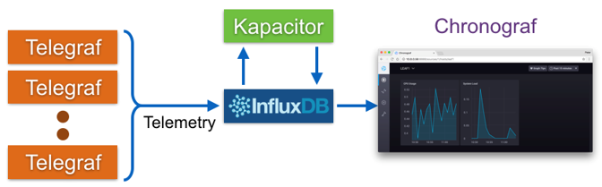

# 3. Tower Lab

## Objective


This lab objective is to build a tower to monitor the system and visualize the information being monitored.

In this lecture, We will monitor the Kafka broker cluster built the last time.

### TSDB (Time Series Database)


Time series data is arrays of numbers indexed by time.

#### InfluxDB


InfluxDB is an open-source time-series database (TSDB) developed by the company InfluxData.
It is written in the Go programming language for storage and retrieval of time series data in fields such as operations monitoring, application metrics, Internet of Things sensor data, and real-time analytics.

#### Chronograf




Chronograf is the user interface and administrative component of the InfluxDB `1.x` platform.
Chronograf allows you to quickly see the data that you have stored in InfluxDB so you can build robust queries and alerts.
It is simple to use and includes templates and libraries to allow you to rapidly build dashboards with real-time visualizations of your data.

## Practice

### Make and Run InfluxDB Container

```bash
sudo docker run -d --name=influxdb --net=host influxdb:1.7
```

### Make and run Chronograf container

```bash
sudo docker run -p 8888:8888 --net=host chronograf --influxdb-url=http://<NUC IP>:8086
```

### Install python-pip

```bash
sudo apt-get install -y libcurl4 openssl curl python3-pip
```

### Install python packages

```bash
sudo pip install requests kafka-python influxdb msgpack
```

### Modify `broker_to_influxdb.py` code

```bash
vi ~/SmartX-mini/ubuntu-kafkatodb/broker_to_influxdb.py
```

In this file, change `<NUC_IP>` into your actual NUC IP.

> ex) '203.237.53.100:9091'


### Run `broker_to_influxdb.py` python code

Before this, you need to check Kafka brokers are running, and there exists the topic named `resource`.

```bash
bin/kafka-topics.sh --describe --zookeeper localhost:2181 --topic resource # Check existence of topic `resource` of zookeeper in localhost:2181
```

Run `broker_to_influxdb.py`.

````bash
sudo sysctl -w fs.file-max=100000
ulimit -S -n 2048
python3 ~/SmartX-mini/ubuntu-kafkatodb/broker_to_influxdb.py
````

### Open your web browser and connect to Chronograf Dashboard

> ( http:// "YOUR NUC IP" :8888 )


### Create Dashboard


### Add data


### Submit query

```sql
SELECT "memory" FROM "Labs"."autogen"."labs" WHERE time > :dashboardTime:
```


### We can see the changes in values from influxDB.


## Lab Summary

With Tower Lab, you have experimented role of Monitor Tower.

Visibility Center function to enable ‘distributed monitoring’ over remote Boxes and to store ‘monitoring information’ to TSDB(Time Series Database).
