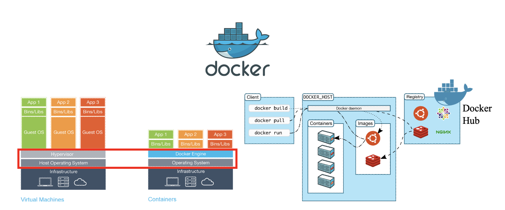
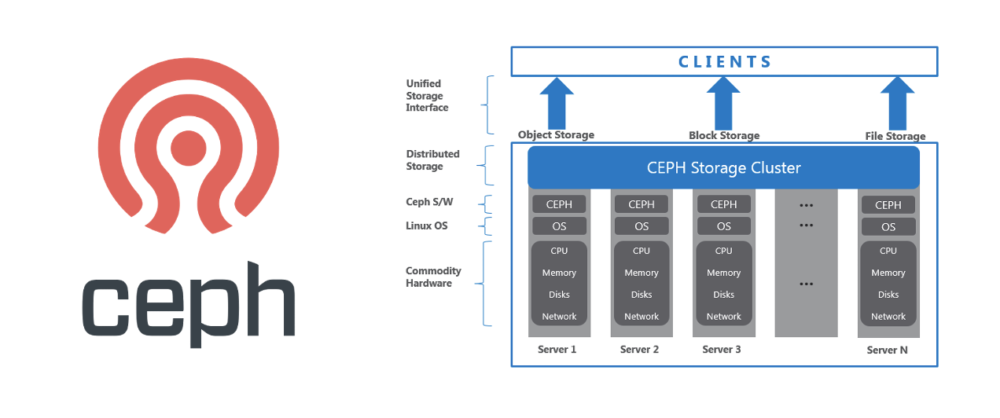
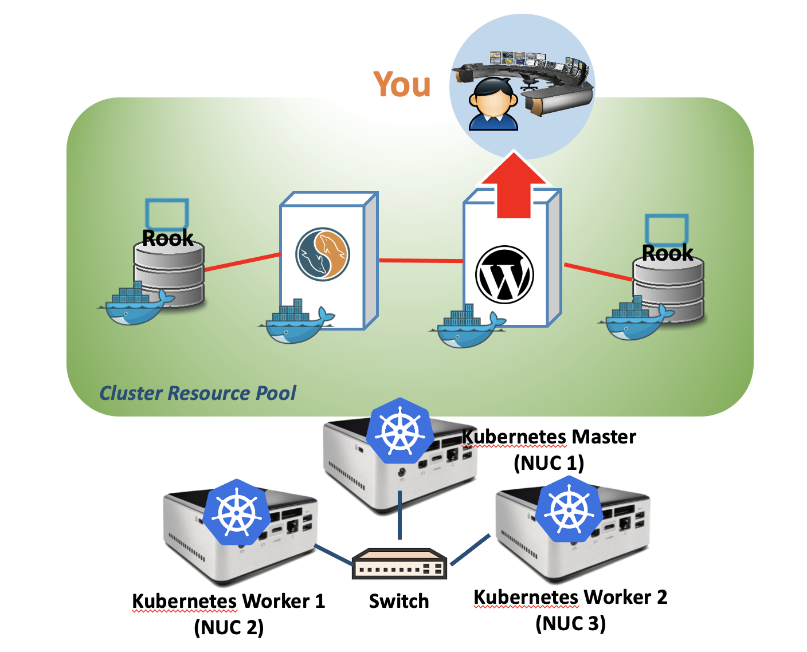
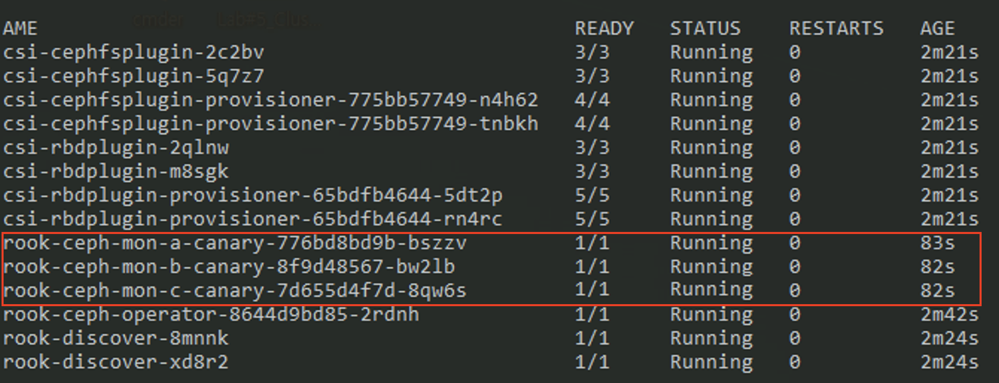
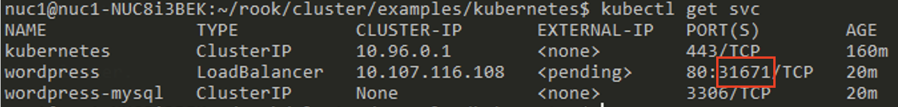

# Lab#5. Cluster Lab

## Objective

- In Lab1 Box Lab, we deployed virtual machine and docker container for deploy isolated applications in specific enviornment 
- Kubernetes can automate deployment, scaling and management applications that containerized by docker. It is called container orchestrator.
- In this section, we combine 3 NUC machine with Kubernetes.
  - 1 Master -> NUC1
  - 2 Worker -> NUC2, NUC3
- On this cluster, we will install distributed storage system called ceph. 
  - With similar concept with docker - kubernetes, Rook is open source cloud-native Ceph strogae orchestrator for K8S.

## Concept

### Docker Containers



- **Docker** is an open platform for building, shipping and running distributed applications. It gives programmers, development teams and operations engineers the common toolbox they need to take advantage of the distributed and networked nature of modern applications.

### Container Orchestration


- **Container orchestration** refers to the process of organizing the work of individual components and application layers.
- **Container orchestration engines** all allow users to control when containers start and stop, group them into clusters, and coordinate all of the processes that compose an application. Container orchestration tools allow users to guide container deployment and automate updates, health monitoring, and failover procedures.

### Kubernetes


- **Kubernetes** is an open-source system for automating deployment, scaling, and management of containerized applications.

#### **Kubernetes** **Features**

- **Horizontal scaling**: Scale your application up and down with a simple command, with a UI, or automatically based on CPU usage.
- **Self-healing:** Restarts containers that fail, replaces and reschedules containers when nodes die, kills containers that don't respond to your user-defined health check, and doesn't advertise them to clients until they are ready to serve.
- **Service discovery and load balancing:** No need to modify your application to use an unfamiliar service discovery mechanism. Kubernetes gives containers their own IP addresses and a single DNS name for a set of containers, and can load-balance across them. 
- **Storage Orchestration:** Automatically mount the storage system of your choice, whether from local storage, a public cloud provider 

### Ceph and Rook

#### Ceph



- **Ceph** is a unified, distributed storage system designed for excellent performance, reliability and scalability. 

  Ceph provide Ceph Object Storage and/or Ceph Block Device services to Cloud Platforms, deploy a Ceph Filesystem or use Ceph for another purpose, all Ceph Storage Cluster deployments begin with setting up each Ceph Node, your network, and the Ceph Storage Cluster. 

  A Ceph Storage Cluster requires at least one Ceph Monitor, Ceph Manager, and Ceph OSD (Object Storage Daemon). The Ceph Metadata Server is also required when running Ceph Filesystem clients.

#### Rook


- **Rook** is an open source cloud-native **Ceph** **storage orchestrator** for Kubernetes, providing the platform, framework, and support for a diverse set of storage solutions to natively integrate with cloud-native environments.
- Rook turns storage software into self-managing, self-scaling, and self-healing storage services. It does this by automating deployment, bootstrapping, configuration, provisioning, scaling, upgrading, migration, disaster recovery, monitoring, and resource management. Rook uses the facilities provided by the underlying cloud-native container management, scheduling and orchestration platform to perform its duties.

## Practice



## Lab Preparation


### For NUC1

``` shell
# In new terminal
ssh <nuc2 name>@<nuc2 IP address>
>  <nuc2 name>@<nuc2 IP address>’s password : <nuc2 pw>

# In another new terminal
ssh <nuc3 name>@<nuc3 IP address>
>  <nuc3 name>@<nuc3 IP address>’s password : <nuc3 pw>

```

### For All NUCs

```shell
# From NUC 1 :
sudo hostname nuc01
# From NUC 2 :
sudo hostname nuc02
# From NUC 3 :
sudo hostname nuc03

# For All NUCs
sudo vi /etc/hosts
# Append the following context into /etc/hosts :
	127.0.0.1	localhost
	<IP Address of NUC 1>  nuc01
	<IP Address of NUC 2>  nuc02
	<IP Address of NUC 3>  nuc03
```

### Check Connectivity

```shell
# From NUC1
ping nuc02
ping nuc03

# From NUC2
ping nuc01
ping nuc03

# From NUC3
ping nuc01
ping nuc02
```


## Preparations for Clustering

### Docker Intall : Prerequisite for Kubernetes

- Install packages to allow apt to use a repository over HTTPS 

```shell
# For All NUCs
sudo apt-get update
sudo apt-get install \
    ca-certificates \
    curl \
    gnupg \
    lsb-release
```

- Add Docker's official GPG key

```shell
# For All NUCs
curl -fsSL https://download.docker.com/linux/ubuntu/gpg | sudo gpg --dearmor -o /usr/share/keyrings/docker-archive-keyring.gpg
```

- Add the Docker apt repository

```shell
# For All NUCs
echo \
  "deb [arch=$(dpkg --print-architecture) signed-by=/usr/share/keyrings/docker-archive-keyring.gpg] https://download.docker.com/linux/ubuntu \
  $(lsb_release -cs) stable" | sudo tee /etc/apt/sources.list.d/docker.list > /dev/null
```

- Install Docker CE

```shell
# For All NUCs
sudo apt-get update && sudo apt-get install -y --allow-downgrades \
          containerd.io=1.2.13-2 \
          docker-ce=5:19.03.11~3-0~ubuntu-$(lsb_release -cs) \
          docker-ce-cli=5:19.03.11~3-0~ubuntu-$(lsb_release -cs)
```

- Set up the Docker daemon

```shell
# For All NUCs
cat <<EOF | sudo tee /etc/docker/daemon.json
{
  "exec-opts": ["native.cgroupdriver=systemd"],
  "log-driver": "json-file",
  "log-opts": {
    "max-size": "100m"
  },
  "storage-driver": "overlay2"
}
EOF
```

- Create ` /etc/systemd/system/docker.service.d `

```shell
# For All NUCs
sudo mkdir -p /etc/systemd/system/docker.service.d 

sudo systemctl daemon-reload 
sudo systemctl enable docker 
sudo systemctl restart docker 
sudo systemctl restart docker.socket

```

### xfprogs Install : Prerequisite for ROOK

```shell
# For All NUCs
sudo apt-get install xfsprogs
```

## Kubernets Installation(For All NUCs)


- NUC 1 : Master
- NUC 2 : Worker 1
- NUC 3 : Worker 2

### Swapoff

```shell
# For All NUCs
sudo swapoff -a
sudo sed -e '/\/swapfile/s/^/#/g' -i /etc/fstab
sudo sed -e '/\/swap\.img/s/^/#/g' -i /etc/fstab
```

### Initialization patition for installing Ceph

```shell
# For All NUCs
sudo wipefs --all /dev/<partition>
```

### Install Kubernetes

```shell
# For All NUCs
sudo apt-get update && sudo apt-get install -y apt-transport-https curl ipvsadm wget

cat <<EOF | sudo tee /etc/apt/sources.list.d/kubernetes.list deb http://apt.kubernetes.io/ kubernetes-xenial main
EOF

curl -s https://packages.cloud.google.com/apt/doc/apt-key.gpg | sudo apt-key add -

sudo apt-get update && sudo apt-get install -y --allow-downgrades kubelet=1.14.1-00 kubeadm=1.14.1-00 kubectl=1.14.1-00 kubernetes-cni=0.7.5-00
```

## Kubernetes Configuration

### Kubernetes Master Setting(For NUC1)

```shell
# For NUC1
sudo kubeadm reset -f
sudo rm -rf /etc/cni/net.d
sudo ipvsadm --clear 
```

```shell
# For NUC1
## Cleanup Rook Configuration
sudo rm -rf /var/lib/rook
sudo kubeadm init --ignore-preflight-errors=all
```

- **Copy  the commnad for joining Kubernetes Nodes(NUC2, NUC3)** 


```shell
# For NUC1
## make kubectl work for your non-root user.
rm -r $HOME/.kube
mkdir -p $HOME/.kube
sudo cp -i /etc/kubernetes/admin.conf $HOME/.kube/config
sudo chown $(id -u):$(id -g) $HOME/.kube/config
kubectl taint nodes --all node-role.kubernetes.io/master-
```

### Kubernetes Worker Setting(For NUC2, NUC3)

```shell
# For NUC2, NUC3
sudo kubeadm reset -f
sudo rm -r /etc/cni/net.d
sudo ipvsadm --clear

## Cleanup Rook Configuration
sudo rm -rf /var/lib/rook

## Join NUC2, NUC3 to Kuberentes Master Node (NUC1)
# ---- Paste the command you copied at Kubernetes Master Setting(For NUC1) ---- #
sudo kubeadm join <NUC1 IP>:6443 --token <YOUR TOKEN> --discovery-token-ca-cert-hash <YOUR HASH> --ignore-preflight-errors=all
```

### Check Nodes at NUC1

````shell
# For NUC1
Kubectl get node
````

## Kubenetes Network Plugin Installation

```shell
# For NUC1
kubectl apply -f "https://cloud.weave.works/k8s/net?k8s-version=$(kubectl version | base64 | tr -d '\n')"
```

```shell
# For NUC1 -> Check Weave works
kubectl get nodes
kubectl get po -n kube-system -o wide
```


## ROOK Installation

### Remove RBAC

```shell
# For NUC1
kubectl create clusterrolebinding permissive-binding \
--clusterrole=cluster-admin \
--user=admin \
--user=kubelet \
--group=system:serviceaccounts
```

### Install ROOK Storage

```shell 
# For NUC1
cd $HOME
git clone --single-branch --branch release-1.2 https://github.com/rook/rook.git
cd $HOME/rook/cluster/examples/kubernetes/ceph
kubectl create -f common.yaml
kubectl create -f operator.yaml
kubectl create -f cluster-test.yaml
```

### Check rook-ceph-pod

```shell
watch kubectl get pod -n rook-ceph
```



### Install & Execute ToolBox

```shell
# For NUC1
## Installation
cd $HOME/rook/cluster/examples/kubernetes/ceph
kubectl create -f toolbox.yaml
kubectl -n rook-ceph  rollout status deploy/rook-ceph-tools
## Execution
kubectl -n rook-ceph exec -it $(kubectl -n rook-ceph get pod -l “app=rook-ceph-tools”\
   -o jsonpath=‘{.items[0].metadata.name}’) bash
   
## Check ceph Status in the toolbox
watch ceph status
exit
```

### Add StorageClass

```shell
# For NUC1
kubectl apply -f csi/rbd/storageclass-test.yaml
```

## WordPress Installation

### Deploy WordPress on the Cluster


```shell
# For NUC1
kubectl create -f $HOME/rook/cluster/examples/kubernetes/mysql.yaml
kubectl create -f $HOME/rook/cluster/examples/kubernetes/wordpress.yaml

# For NUC1
## Check WordPress Container
watch kubectl get pod
```

### Access Wordpress Web



```shell
# For NUC1
kubectl get svc
```

- Enter following address in web browser

  `http://<your NUC1 IP>:<Exposed port>`