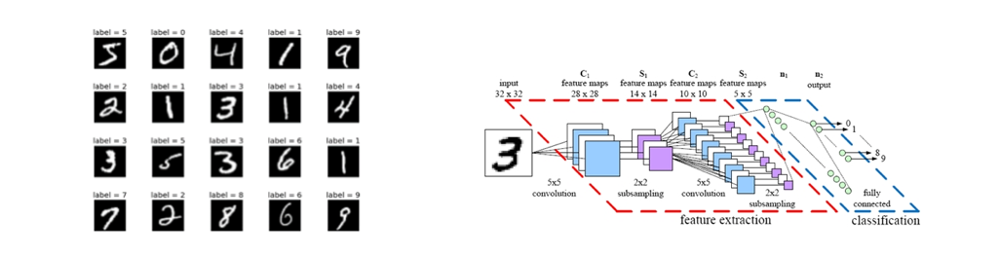
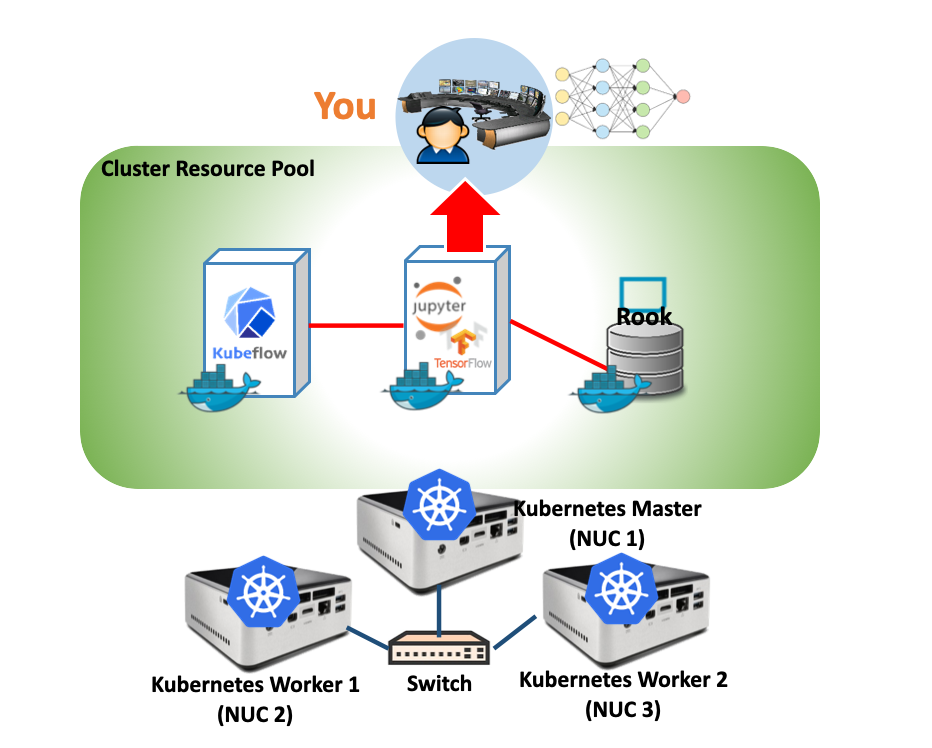
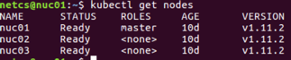
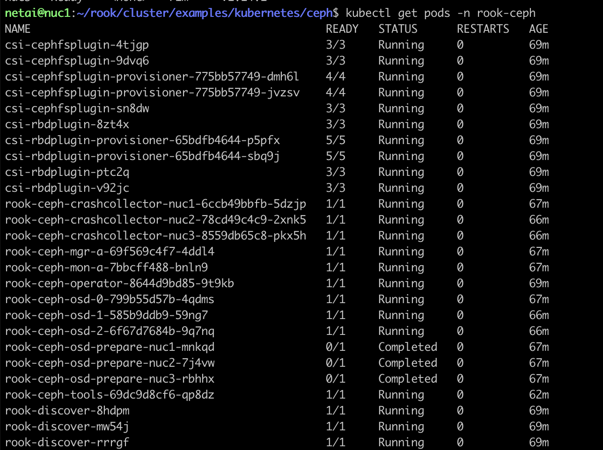
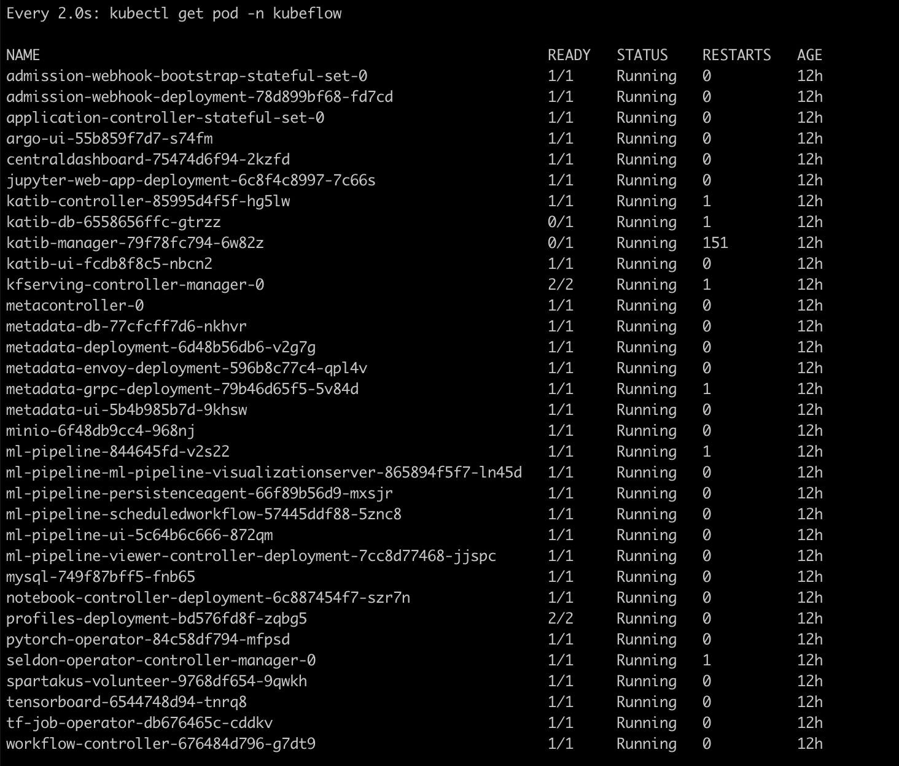
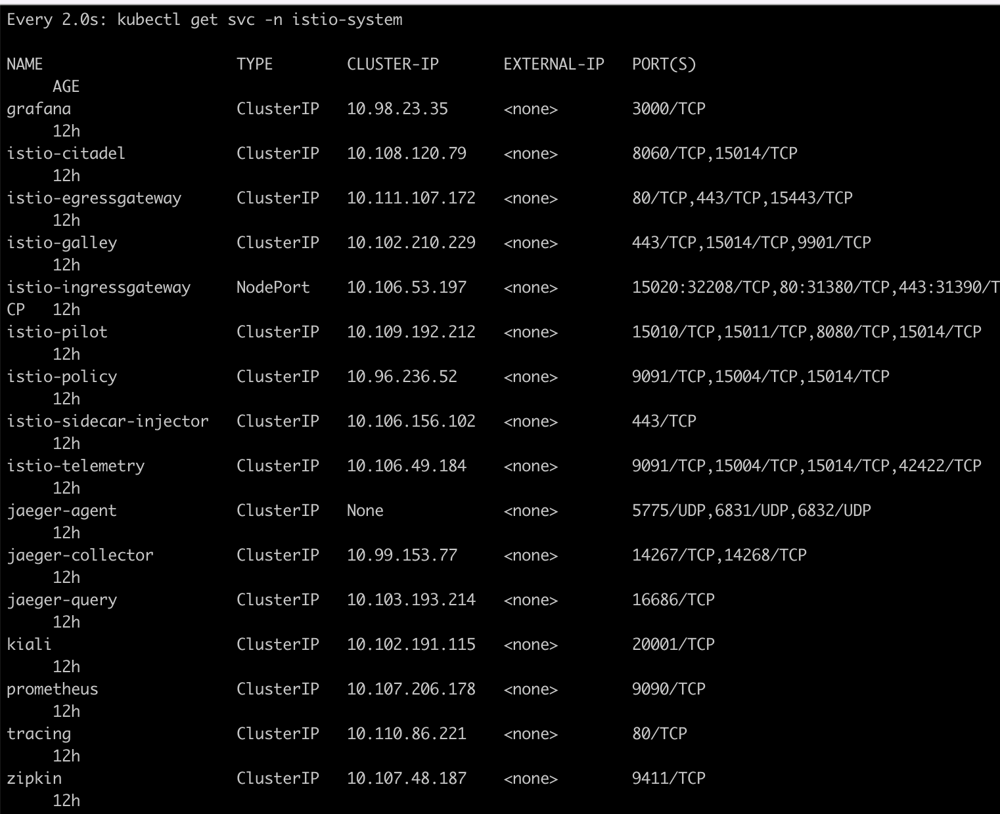
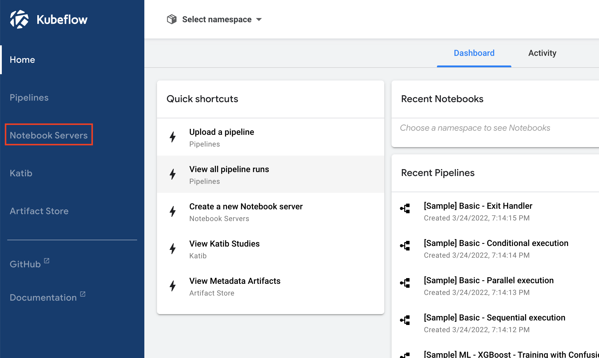
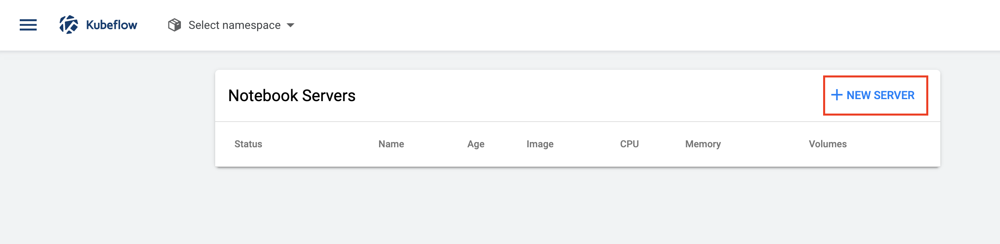
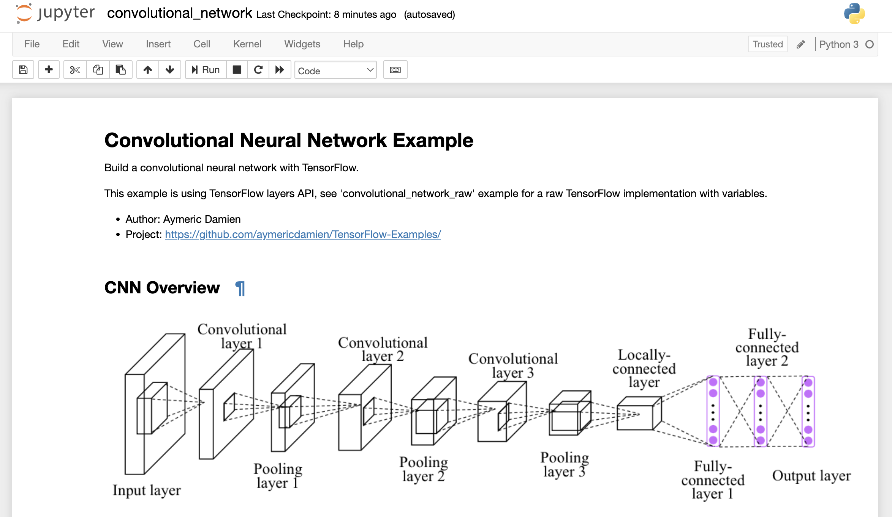

# 6. Analytics Lab

## Objective

Deploy `Machine Learning` workflows on Kubernetes Cluster with `Kubeflow` project. Then, we can run a Sample ML code `MNIST` on Jupyter Notebook that served by kubeflow.

The minimum specification of the latest version of 'kubeflow' exceeds that of NUC. Therefore, we will install a version of *0.7* that meets the specifications.

## Concept
### Kubeflow

The [**Kubeflow**](https://www.kubeflow.org/) project is dedicated to making deployments of machine learning (ML) workflows on Kubernetes simple, portable and scalable. Our goal is not to recreate other services, but to provide a straightforward way to deploy best-of-breed open-source systems for ML to diverse infrastructures. Anywhere you are running Kubernetes, you should be able to run Kubeflow.

### TensorFlow & Jupyter Notebook

[**TensorFlow**](https://github.com/tensorflow/tensorflow) is an open-source machine learning library for research and production. TensorFlow offers APIs for beginners and experts to develop for desktop, mobile, web, and cloud.
**Jupyter Notebook** is an open-source web application that allows you to create and share documents that contain live code, equations, visualizations and narrative text. Uses include: data cleaning and transformation, numerical simulation, statistical modeling, data visualization, machine learning, and much more.
### MNIST

The **MNIST** database (Modified National Institute of Standards and Technology database) is a large database of handwritten digits that is commonly used for training various image processing systems.[1][2] The database is also widely used for training and testing in the field of machine learning.


# Practice

### Check Docker K8s version

- docker=v19.03.11
- kubelet=v1.14.1
- kubeadm=v1.14.1
- kubectl=v1.14.1
### Check K8s Cluster status
```bash
kubectl get nodes
```

```bash
kubectl get pods -n rook-ceph
```

Check Rook are running healthy on your cluster.

## Kubeflow Set-up

### Set Rook Storageclass to default for kubeflow
```bash
kubectl patch storageclass rook-ceph-block -p '{"metadata":{"annotations":{"storageclass.kubernetes.io/is-default-class":"true"}}}'
```

### Check StorageClass
```bash
kubectl get storageclass
```


### Kubeflow Install

```bash
# Configuration
export BASE_DIR=$HOME/kubeflow
mkdir -p $BASE_DIR && pushd $BASE_DIR

# Download kfctl
KFCTL_FILE=kfctl_v0.7.1-2-g55f9b2a_linux.tar.gz
wget https://github.com/kubeflow/kfctl/releases/download/v0.7.1/${KFCTL_FILE}
tar -xf $KFCTL_FILE && rm $KFCTL_FILE
sudo mv kfctl /usr/local/bin/kfctl

# Set environment variables
export KF_NAME="my-kubeflow"
export KF_DIR=${BASE_DIR}/${KF_NAME}
export PATH=$PATH:$BASE_DIR
export CONFIG_URI="https://raw.githubusercontent.com/kubeflow/manifests/v0.7-branch/kfdef/kfctl_k8s_istio.0.7.0.yaml"

# Install kubeflow
rm -rf $KF_DIR; mkdir -p $KF_DIR && cd $KF_DIR
kfctl apply -V -f $CONFIG_URI
popd
```

### Monitor kubeflow installation

```bash
watch kubectl get pod -n kubeflow
watch kubectl get svc -n istio-system
```
> Wait until all Container Running



`ctrl + c` for stop watching

## Connect Jupyter hub

### Check exposed port for Kubeflow
You can access Kubeflow at this address (In Browser)
> http://{nuc01_IP}:{PORT}

Get {Port} by below command
```bash
kubectl -n istio-system get svc istio-ingressgateway -o jsonpath='{.spec.ports[?(@.name=="http2")].nodePort}'
```

### Deploy ML Container (MNIST)

#### Assign NoteBook Server
Open a web browser and enter the Kubeflow address



Select or enter the options as below
- Image: gcr.io/kubeflow-images-public/tensorflow-1.14.0-notebook-cpu:v0.7.0
- CPU: 2
- Memory: 2Gi


#### Run MNIST CNN Example
Now, you will run the MNIST example code in sample notebook.
Click kernel -> “Restart&Clear Output” button -> “Restart&Run All” button

The training takes a few **minutes** (Wait!!!!!!!!)


Check training results
Your model has 99.04% accuracy!

Your Machine Learning model correctly identified the number in the images!

### Lab Summary
1. How to create ML/DL environment on a container-orchestrated cluster? (Kubeflow, …)
2. How to operate desired ML training by testing selected ML code (i.e., neural networks) over the prepared training data?
3. Do you understand the overall workflow for running ML/DL?

> Thank You for Your Attention Any Questions? -> twkim@smartx.kr