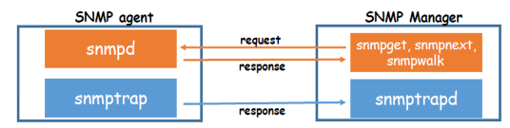

# Lab#2. InterConnect Lab

## 0. Objective

The main part of interConnect Lab is to connect one box with another box which connects computer systems in 2 ways. (Physical interconnect, Data interconnect)

- Physical Interconnect: Connection between boxes via the network.
- Data Interconnect: By using physical Interconnect, connect data between various functions.

## 1. Concept

### 1-1. Raspberry PI

Raspberry PI is a small, embedded computer designed by Raspberry Pi Foundation. It has different HW and properties. For example, It doesn't have HW real-time clock. So, after booting, the time of PI is initialized. In this lecture, we will use Pi2.

### 1-2. Apache Kafka


A messaging systems are designed for better and more convenient, reliable message transfer than end-to-end way. Apache Kafka is a messaging system with a unique design and functionality. It is a high-performance, distributed, fault-tolerant, and reliable messaging system.

- Topics: maintains feeds of messages in categories
- Producer: processes that publish messages to a Kafka topic
- Consumer: processes that subscribe to topics and process the feed of published messages
- Broker: run as a cluster comprised of one or more servers

### 1-3. Net-SNMP

A suite of software for using and deploying the SNMP Protocol.

- Manager: polls agents on the network, correlates, and displays information
- Agent: collects and stores information, responds to manager requests for information, generates traps



The SNMP(Simple Network Management Protocol) is used in network management systems to monitor network-attached devices, which include routers, switches, servers, workstations, printers, modem racks, and more.


### 1-4. Apache-Flume


A distributed, reliable, and available service for efficiently collecting, aggregating, and moving large amounts of log data with many customizable sources, which runs asynchronously. Flume Agents consists of three concepts.

- Source: Consumes events having a specific format
- Channel: Holds the event until consumed
- Sink: Removes an event from the channel and puts it into an external repository or another source

### 1-5. Docker

"Docker” is a containerization technology that enables the creation and use of Linux® containers. Based on containerization, you can use it for Application deployment.


## 2. Practice


> If you have a problem with the internet connection even the box can send a ping to the gateway. You can fix this problem by editing `etc/resolv.conf`. Open `/etc/resolv.conf`
>
> ```bash
> sudo vim /etc/resolv.conf 
> ```
>
> Add name server like below.
>
> ```text
> ...
> # operation for /etc/resolv.conf
> nameserver 203.237.32.100
> ```
>
> After every boot, the content of `/etc/resolv.conf` is gone, you should do the above steps again.

### 2-1. Raspberry PI OS Installation

> You should turn off your VM used in Box Lab to prevent IP conflict.
>
> ```bash
> sudo killall -9 qemu-system-x86_64
> ```

Before we start, your Raspberry Pi must be ready with the proper OS. In this lab, we will use “HypriotOS” Linux for it. Insert a Micro SD into your SD card reader and attach the reader to your NUC.

> When you deal with the SD card, be sure that PI is shut down. Ejecting an SD card when PI is booted on is one of the main causes of SD card corruption which results in a fatal error.
> If you want to unmount your SD card safely, turn off PI with the `poweroff` command.
>
> ```bash
> sudo poweroff # It requires superuser permission.
> ```

#### 2-1-1. Download Required Package and File(In NUC)

Type the commands below to get the “flash” script for the OS setup. Then, type the `flash` command to see if it’s installed correctly.

```bash
sudo apt update && sudo apt install -y pv curl python3-pip unzip hdparm
sudo pip3 install awscli
curl -O https://raw.githubusercontent.com/hypriot/flash/master/flash
chmod +x flash
sudo mv flash /usr/local/bin/flash
```
<details>
<summary>Package Versions (Expand)</summary>

##### NUC
|    Package    |    Version          |
|:-------------:|:-------------------:|
| pv            | 1.6.6-1             |
| curl          | 7.68.0-1ubuntu2.15  |
| python3-pip   | 20.0.2-5ubuntu1.7   |
| unzip         | 6.0-25ubuntu1.1     |
| hdparm        | 9.58+ds-4           |
##### Python
|    Package    |    Version          |
|:-------------:|:-------------------:|
| awscli        |1.27.59             |

</details>
<br>


After installing `flash`, clone the repository from Github. You need to install `git-lfs` first because this repository contains large files.

```bash
cd ~
sudo apt install -y git
curl -s https://packagecloud.io/install/repositories/github/git-lfs/script.deb.sh | sudo bash
sudo apt install -y git-lfs
git lfs install
git clone https://github.com/SmartX-Labs/SmartX-Mini.git
cd ~/SmartX-Mini/SmartX-Mini-2023\ Collection/Experiment/Lab-2.\ InterConnect/
```
<details>
<summary>Package Versions (Expand)</summary>

##### NUC
|    Package    |    Version          |
|:-------------:|:-------------------:|
| git            | 1:2.25.1-1ubuntu3.8   |
| git-lfs          | 3.3.0 |


</details>
<br>
Next, you need to download HypriotOS from GitHub

```bash
wget https://github.com/hypriot/image-builder-rpi/releases/download/v1.12.3/hypriotos-rpi-v1.12.3.img.zip
ls -alh # Check all files
```

#### 2-1-2. Edit HypriotOS setting and flash SD card.(In NUC)

To modify the HypriotOS configuration file for your Raspberry Pi, open the `network-config` file and edit its network section. DO NOT change a filename of the file.

```bash
sudo vim network-config
```

```yaml
…
    addresses:
      - 172.29.0.xxx/24 # change xxx to your pi address!
    gateway4: 172.29.0.254
    nameservers:
      addresses: [203.237.32.100, 203.237.32.101] # write your DNS servers
…
```

The assigned IP address will be automatically applied when you’re initially booting your Raspberry Pi via cloud-init.

To flash your OS to an SD card, you need to know where your card is mounted. Find the partition that have similar volume value with your SD cards. If your SD is a 32GB card, It has value about 29.83 GiB.

```bash
sudo fdisk -l
```


Then flash HypriotOS to your MicroSD Card. This takes a while, wait for a moment.

```bash
flash -u hypriotos-init.yaml -F network-config hypriotos-rpi-v1.12.3.img.zip -d <Your SD Card Directory>
```

Insert the SD card back into your Raspberry PI and boot it up. Initial user is `pirate`, and password is `hypriot`.

### 2-2. Raspberry PI network Configuration

#### 2-2-1. Check network setting(In PI)

In PI, type `ifconfig` to check your network interface setting

```bash
ifconfig
```

Then check the routing table

```bash
netstat -rn
```

#### 2-2-2. Install required packages(In PI)

You need to install several packages in PI.

```bash
sudo apt update
sudo apt install -y git vim rdate openssh-server
```
<details>
<summary>Package Versions (Expand)</summary>

##### PI
|    Package     |    Version          |
|:--------------:|:-------------------:|
| git            | 1:2.20.1-2+deb10u7  |
| vim            | 2:8.1.0875-5+deb10u4|
| rdate          | 1:1.2-6             |
| openssh-server | 1:7.9p1-10+deb10u2+rpt1    |

</details>
<br>
The `rdate` sync your PI's time to network. We will handle it in The next section

#### 2-2-3. Access PI via SSH in NUC(In NUC)

After installing `openssh-server`, you can access your PI from other boxes via SSH.

```bash
ssh pirate@[PI_IP] #ID: pirate PW: hypriot
```

Now you can type command to PI in NUC terminal.

> If you see this error, then type the command in the error message, It is caused by different ssh keys with the same IP, such as different boxes with the same IP.
>
> 
>
> ```bash
> ssh-keygen -f "home/$(whoami)/.ssh/know_hosts" -R "[PI_IP_ADDRESS]"
> ```

### 2-3. Check `crontab` Setting to sync clock (In PI)

The clock of Raspberry PI only remains 17 minutes after power off. In this section, we will use `crontab` run every boot.

```bash
sudo crontab -e
```

Choose editor you want, and insert code.

```bash
@reboot sleep 60 && rdate -s time.bora.net
```

In 60 seconds after booting, `rdate` sync clock to `time.bora.net`.

<!-- 시각이 맞춰지는데 60초 정도 걸리기 때문에 별로 쓰고 싶지는 않았는데, 부팅 마지막에 실행되는 `rc.local` 의 경우, After=network-online.target(네트워크가 다 켜진 다음 rc.local 실행)을 지정해도 DNS 에러가 뜨고(부팅 후에 같은 커맨드 쓰면 안 뜸), crontab 같은 경우에도 저 60초 정도 기다리지 않으면 DNS 에러가 발생했습니다. 60초는 짧긴 하지만 그래도 이 사이에 시계가 정확해야 하는 일 실행해서 오류가 난다면 아래 수동으로 시간 맞추는 커맨드를 입력하라 합시다.-->

Reboot your PI.

```bash
sudo reboot
```

If the clock is still wrong, you can manually sync the clock.

```bash
sudo rdate -s time.bora.net
```

### 2-4. Hostname Preparation

Every machine in a network that communicates with itself must know its address. This information is stored in `/etc/hosts`.

#### 2-4-1. Hostname preparation for Kafka(In NUC)

To check your hostname, you can use  the `hostname` command.

```bash
hostname
```

Open `/etc/hosts` in NUC.

```bash
sudo vim /etc/hosts
```

Add 2 lines below the file.

```text
[NUC_IP] [NUC_HOSTNAME]
[PI_IP] [PI_HOSTNAME]
```

For example,

```text
172.29.0.XX nuc
172.29.0.XX pi
```

#### 2-4-2. Hostname preparation for Kafka(In PI)

Repeat the same job in Raspberry PI.

```bash
sudo vim /etc/hosts
```

Add 2 lines below the file.

```text
[NUC_IP] [NUC_HOSTNAME]
[PI_IP] [PI_HOSTNAME]
```

When pi is rebooted, the information in `/etc/hosts` disappears.

#### 2-4-3. Verification for hostname preparation(In PI, NUC)

For NUC,

```bash
sudo ping [Your NUC hostname]
sudo ping [Your Raspberry PI hostname]
```

For Raspberry PI,

```bash
sudo ping [Your NUC hostname]
sudo ping [Your Raspberry PI hostname]
```

If it was successful, We can be sure that NUC knows its hostname and Pi’s hostname and Pi also know its hostname and NUC’s hostname.

### 2-5. Kafka Deployment(IN NUC)

We’ll use one zookeeper, 3 brokers, and one consumer containers that share the host’s public IP address. The zookeeper container doesn’t have a broker id. Each Broker has a unique id and port to interact with each other. The consumer container is just used to manage topics and check the data from brokers.

| Function(container) Name | IP Address | Broker ID | Listening Port |
|:------------------------:|:----------:|:---------:|:--------------:|
|         zookeeper        |  Host's IP |     -     |      2181      |
|          broker0         |  Host's IP |     0     |      9090      |
|          broker1         |  Host's IP |     1     |      9091      |
|          broker2         |  Host's IP |     2     |      9092      |
|         consumer         |  Host's IP |     -     |        -       |

#### 2-5-1. Clone repository from GitHub

```bash
cd ~
git clone https://github.com/SmartXBox/SmartX-mini.git
```

In this section, we use `ubuntu-kafka`.

```bash
cd ~/SmartX-mini/ubuntu-kafka
```

#### 2-5-2. Check Dockerfile

Open `Dockerfile` and check it is correct.

```dockerfile
FROM ubuntu:14.04
LABEL "maintainer"="Seungryong Kim <srkim@nm.gist.ac.kr>"

#Update & Install wget
RUN sudo apt-get update
RUN sudo apt-get install -y wget vim iputils-ping net-tools iproute2 dnsutils openjdk-7-jdk

#Install Kafka
RUN sudo wget --no-check-certificate https://archive.apache.org/dist/kafka/0.8.2.0/kafka_2.10-0.8.2.0.tgz -O - | tar -zxv
RUN sudo mv kafka_2.10-0.8.2.0 /kafka
WORKDIR /kafka
```

If you want to build faster, change APT source repository to domestic. Open `Dockerfile` and add `RUN sed -i 's@archive.ubuntu.com@mirror.kakao.com@g' /etc/apt/sources.list` right before the apt update.

```dockerfile
…

RUN sed -i 's@archive.ubuntu.com@mirror.kakao.com@g' /etc/apt/sources.list
#Update & Install wget
RUN sudo apt-get update
RUN sudo apt-get install -y wget vim iputils-ping net-tools iproute2 dnsutils openjdk-7-jdk
…
```


#### 2-5-3. Build docker image

Then build docker image with `docker build`. It takes a long time.

```bash
sudo docker build --tag ubuntu-kafka . #You should type '.'
```

It's good to know basic docker commands. For more detail, visit [docker official document](https://docs.docker.com/engine/reference/commandline/cli/).

```bash
sudo docker --help #show docker instruction 
sudo docker ps # show list of container
sudo docker rm # remove docker container
sudo docker start [container_name] # start docker container
sudo docker stop [container_name] # stop docker container
sudo docker attach [container_name] # connect docker container
```

#### 2-5-4. Place docker containers

After building the `ubuntu-kafka` image, make, run and attach the docker container

```bash
sudo docker run -it --net=host --name [container name] ubuntu-kafka
```

We need to run total 5 containers (`zookeeper`, `broker0`, `broker1`, `broker2`, `consumer`)

#### 2-5-5. Zookeeper configuration(IN NUC, `zookeeper` container)

In the `zookeeper` container, Open the zookeeper properties file.

```bash
sudo vi config/zookeeper.properties
```

Check the client port is `2181`

Execute the zookeeper first, leave the zookeeper running and open a new terminal for the next tasks.

```bash
bin/zookeeper-server-start.sh config/zookeeper.properties 
```

#### 2-5-6. Broker configuration(IN NUC, `broker0`, `broker1`, `broker2` containers)

Open server properties file and change proper broker id and port. They must be unique to each other.

```bash
sudo vi config/server.properties
```

| Function(container) Name | IP Address | Broker ID | Listening Port |
|:------------------------:|:----------:|:---------:|:--------------:|
|          broker0         |  Host's IP |     0     |      9090      |
|          broker1         |  Host's IP |     1     |      9091      |
|          broker2         |  Host's IP |     2     |      9092      |


Execute Kafka brokers.

```bash
bin/kafka-server-start.sh config/server.properties 
```

Repeat this in 3 broker containers. (`broker0`, `broker1`, `broker2`)

#### 2-5-7. Consumer topic configuration(IN NUC, `consumer` container)

Create a topic named `resource` in consumer.

```bash
bin/kafka-topics.sh --create --zookeeper localhost:2181 --replication-factor 1 --partitions 3 --topic resource
```

We can check topics.

```bash
bin/kafka-topics.sh --list --zookeeper localhost:2181 # list all topic of zookeeper in localhost:2181
bin/kafka-topics.sh --describe --zookeeper localhost:2181 --topic resource # Check existence of topic `resource` of zookeeper in localhost:2181
```

### 2-6. Flume on Raspberry PI(IN PI)

#### 2-6-1. Install Net-SNMP installation

```bash
sudo apt update
```

Download Net-SNMP

```bash
sudo apt install -y snmp snmpd snmp-mibs-downloader openjdk-8-jdk
```
<details>
<summary>Package Versions (Expand)</summary>

##### PI
|    Package    |    Version          |
|:-------------:|:-------------------:|
| snmp            | 5.7.3+dfsg-5+deb10u4  |
| snmpd          | 5.7.3+dfsg-5+deb10u4 |
| snmp-mibs-downloader   | 1.2|
| openjdk-8-jdk         | 8u312-b07-1~deb9u1|


</details>
<br>
Modify the configuration file. There is a line `#rocommunity public localhost`. Delete `#`.

```bash
sudo vi /etc/snmp/snmpd.conf
```

Restart `snmpd.service`.

```bash
sudo systemctl restart snmpd.service
```

#### 2-6-2. Clone repository from GitHub

```bash
cd ~
git clone https://github.com/SmartXBox/SmartX-mini.git
```

In this section, we use `raspbian-flume`.

```bash
cd ~/SmartX-mini/raspbian-flume
```

#### 2-6-3. Check Dockerfile

Open `Dockerfile` and check it is correct.

```dockerfile
FROM balenalib/rpi-raspbian:stretch
LABEL "maintainer"="Seungryong Kim <srkim@nm.gist.ac.kr>"

#Update & Install wget, vim
RUN sudo apt update
RUN sudo apt install -y wget vim iputils-ping net-tools iproute2 dnsutils openjdk-8-jdk

#Timezone
RUN sudo cp /usr/share/zoneinfo/Asia/Seoul /etc/localtime

#Install Flume
RUN sudo wget --no-check-certificate http://archive.apache.org/dist/flume/1.6.0/apache-flume-1.6.0-bin.tar.gz -O - | tar -zxv
RUN mv apache-flume-1.6.0-bin /flume
ADD plugins.d /flume/plugins.d
ADD flume-conf.properties /flume/conf/

#Working directory
WORKDIR /flume
```

#### 2-6-4. Build docker image

Then build docker image with `docker build`. It takes a longer time than NUC.

```bash
sudo docker build --tag raspbian-flume .
```

#### 2-6-5. Run flume on container

After building the image, run the `flume`  container.

```bash
sudo docker run -it --net=host --name flume raspbian-flume
```

In, the `flume` container, check the configuration file, and modify the broker list. (Change default  value `nuc` to your own NUC's hostname in `/etc/hosts`)

```bash
sudo vi conf/flume-conf.properties
```

```text
...
agent.sinks.sink1.brokerList = <Your NUC hostname>:9090,<Your NUC hostname>:9091,<Your NUC hostname>:9092
...
```

Then run flume on `flume` container.

```bash
bin/flume-ng agent --conf conf --conf-file conf/flume-conf.properties --name agent -Dflume.root.logger=INFO,console
```

If an error occurs, check the host of pi again.

### 2-7. Consume message from brokers(IN NUC, IN `consumer` container)

Launch consumer script on the `consumer` container.

```bash
bin/kafka-console-consumer.sh --zookeeper localhost:2181 --topic resource --from-beginning
```


## 3. Review

### 3-1. Lab Summary

1. How to physically inter-connect two kinds of Boxes? (NUC and Raspberry PI)
2. How to inter-connect data transfer (via Kafka messaging) between functions located in different boxes?

You need to distinguish physical Inter-connect from data Inter-connect!

> Thank You for Your Attention Any Questions? -> khs0404@smartx.kr
