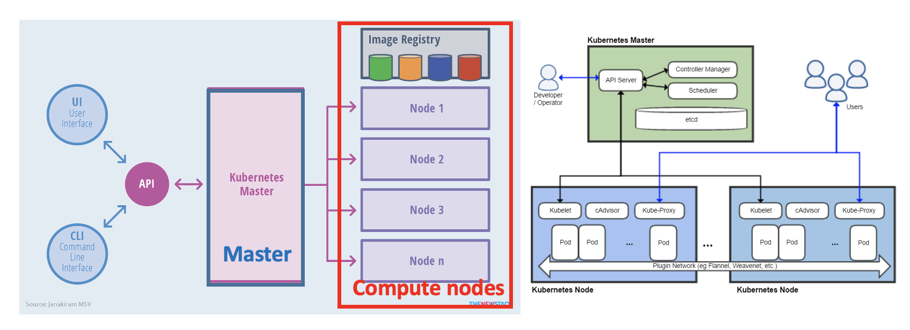
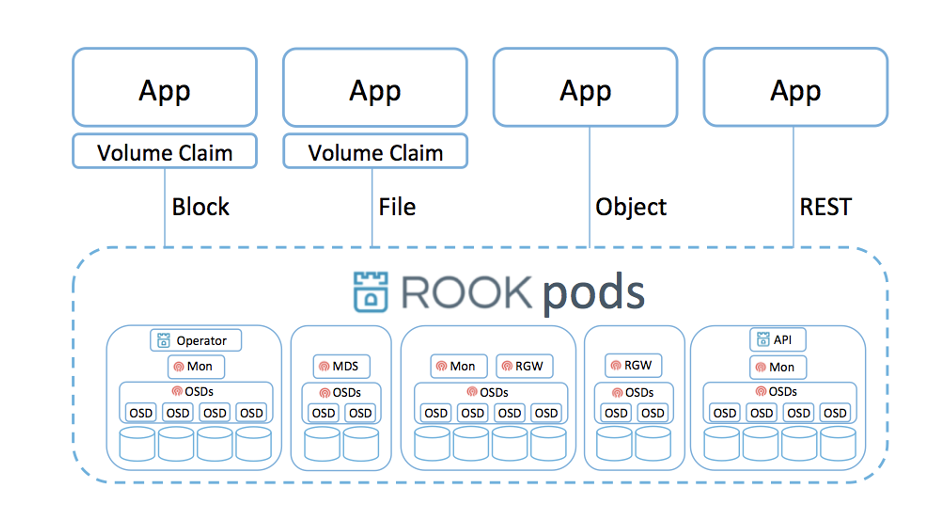
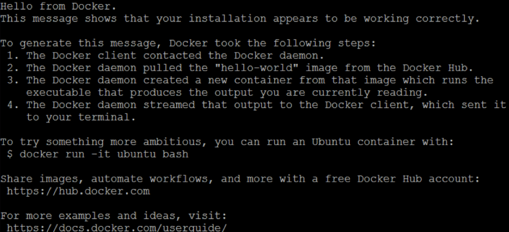

# Lab#5. Cluster Lab

## 0. Objective

- In Lab1 Box Lab, we deployed virtual machine and docker container for deploy isolated applications in specific enviornment
- Kubernetes can automate deployment, scaling and management applications that containerized by docker. It is called container orchestrator.
- In this section, we combine 3 NUC machine with Kubernetes.
  - 1 Master -> NUC1
  - 2 Worker -> NUC2, NUC3
- On this cluster, we will install distributed storage system called ceph.
  - With similar concept with docker - kubernetes, Rook is open source cloud-native Ceph strogae orchestrator for K8S.

## 1. Concept

### 1-1. Docker Containers


- **Docker** is an open platform for building, shipping and running distributed applications. It gives programmers, development teams and operations engineers the common toolbox they need to take advantage of the distributed and networked nature of modern applications.

### 1-2. Container Orchestration


- **Container orchestration** refers to the process of organizing the work of individual components and application layers.
- **Container orchestration engines** all allow users to control when containers start and stop, group them into clusters, and coordinate all of the processes that compose an application. Container orchestration tools allow users to guide container deployment and automate updates, health monitoring, and failover procedures.

### 1-3. Kubernetes



- **Kubernetes** is an open-source system for automating deployment, scaling, and management of containerized applications.

#### 1-3-1. **Kubernetes** **Features**

- **Horizontal scaling**: Scale your application up and down with a simple command, with a UI, or automatically based on CPU usage.
- **Self-healing:** Restarts containers that fail, replaces and reschedules containers when nodes die, kills containers that don't respond to your user-defined health check, and doesn't advertise them to clients until they are ready to serve.
- **Service discovery and load balancing:** No need to modify your application to use an unfamiliar service discovery mechanism. Kubernetes gives containers their own IP addresses and a single DNS name for a set of containers, and can load-balance across them.
- **Storage Orchestration:** Automatically mount the storage system of your choice, whether from local storage, a public cloud provider

### 1-4. Ceph and Rook

#### 1-4-1. Ceph


- **Ceph** is a unified, distributed storage system designed for excellent performance, reliability and scalability.

  Ceph provide Ceph Object Storage and/or Ceph Block Device services to Cloud Platforms, deploy a Ceph Filesystem or use Ceph for another purpose, all Ceph Storage Cluster deployments begin with setting up each Ceph Node, your network, and the Ceph Storage Cluster.

  A Ceph Storage Cluster requires at least one Ceph Monitor, Ceph Manager, and Ceph OSD (Object Storage Daemon). The Ceph Metadata Server is also required when running Ceph Filesystem clients.

#### 1-4-2. Rook



- **Rook** is an open source cloud-native **Ceph** **storage orchestrator** for Kubernetes, providing the platform, framework, and support for a diverse set of storage solutions to natively integrate with cloud-native environments.
- Rook turns storage software into self-managing, self-scaling, and self-healing storage services. It does this by automating deployment, bootstrapping, configuration, provisioning, scaling, upgrading, migration, disaster recovery, monitoring, and resource management. Rook uses the facilities provided by the underlying cloud-native container management, scheduling and orchestration platform to perform its duties.

## 2. Practice


### 2-1. Lab Preparation


#### 2-1-2. From All NUCs

```shell
# From NUC 1 :
sudo hostname nuc01
# From NUC 2 :
sudo hostname nuc02
# From NUC 3 :
sudo hostname nuc03
```

From All NUCs

```shell
sudo vi /etc/hosts
```

Append the following context into /etc/hosts :

```text
 127.0.0.1 localhost
 <IP Address of NUC 1>  nuc01
 <IP Address of NUC 2>  nuc02
 <IP Address of NUC 3>  nuc03
```

#### 2-1-2. Check Connectivity

```shell
# From NUC 1
ping nuc02
ping nuc03

# From NUC 2
ping nuc01
ping nuc03

# From NUC 3
ping nuc01
ping nuc02
```

#### 2-1-3. From NUC1

예시)  
  
**username은 netcs**이고  
hostname은 nuc01입니다!!!

**username is netcs**  
and hostname is nuc01!!!

```shell
# In new terminal
ssh <nuc2 username>@nuc02

# In another new terminal
ssh <nuc3 username>@nuc03
```

#### 2-1-4. Install docker

Docker is a set of platform as a service (PaaS) products that use OS-level virtualization to deliver software in packages called containers. The service has both free and premium tiers. The software that hosts the containers is called Docker Engine. It was first started in 2013 and is developed by Docker, Inc.

Set up the repository

Install packages to allow apt to use a repository over HTTPS

```bash
sudo apt-get update
sudo apt-get install -y ca-certificates curl gnupg lsb-release
```

<details>
<summary>Package Versions (Expand)</summary>

##### NUC

|     Package     |         Version         |
| :-------------: | :---------------------: |
| ca-certificates | 20211016ubuntu0.20.04.1 |
|      curl       |   7.68.0-1ubuntu2.15    |
|      gnupg      |    2.2.19-3ubuntu2.2    |
|   lsb-release   |      11.1.0ubuntu2      |

</details>
<br>

Add Docker's official GPG key

```bash
curl -fsSL https://download.docker.com/linux/ubuntu/gpg | sudo gpg --dearmor -o /usr/share/keyrings/docker-archive-keyring.gpg
```

Add the Docker apt repository

```bash
# For All NUCs
 echo \
  "deb [arch=$(dpkg --print-architecture) signed-by=/usr/share/keyrings/docker-archive-keyring.gpg] https://download.docker.com/linux/ubuntu \
  $(lsb_release -cs) stable" | sudo tee /etc/apt/sources.list.d/docker.list > /dev/null
```

Update APT repos.

```bash
# For All NUCs
sudo apt-get update
```

Install Docker

```bash
sudo apt-get install -y --allow-downgrades \
          containerd.io=1.2.13-2 \
          docker-ce=5:19.03.11~3-0~ubuntu-$(lsb_release -cs) \
          docker-ce-cli=5:19.03.11~3-0~ubuntu-$(lsb_release -cs)
```

<details>
<summary>Package Versions (Expand)</summary>

##### NUC

|    Package    |           Version           |
| :-----------: | :-------------------------: |
| containerd.io |          1.2.13-2           |
|   docker-ce   | 5:19.03.11~3-0~ubuntu-focal |
| docker-ce-cli | 5:19.03.11~3-0~ubuntu-focal |

</details>
<br>

Create /etc/docker

```bash
sudo mkdir -p /etc/docker
```

Set up the Docker daemon

```bash
cat <<EOF | sudo tee /etc/docker/daemon.json
{
  "exec-opts": ["native.cgroupdriver=systemd"],
  "log-driver": "json-file",
  "log-opts": {
    "max-size": "100m"
  },
  "storage-driver": "overlay2"
}
EOF
```

Create /etc/systemd/system/docker.service.d

```bash
sudo mkdir -p /etc/systemd/system/docker.service.d
sudo systemctl daemon-reload
sudo systemctl enable docker
sudo systemctl start docker
sudo systemctl start docker.socket
```

#### 2-1-4. Check docker installation

```bash
sudo docker run hello-world
```

If it doesn’t work, please try several times. Nevertheless, if you are not successful, try running from the installing `docker-ce`, `docker-ce-cli`, `containerd.io`



# 지금부터 NUC1 학생 자리에서 모든 작업을 시작합니다. NUC2, NUC3 학생은 NUC1자리로 가서 작업을 시작합니다.

# From now on, every thing goes with NUC1 student's seat. Students in NUC2, NUC3 should start work at NUC1 student's seat.

### 2-2. Preparations for Clustering

#### 2-2-1. Docker Version Check : Prerequisite for Kubernetes

- Check Docker Version : 19.03.11

```shell
# From All NUCs
docker version
```

# From NUC1

```shell
ssh <NUC2 username>@nuc02
ssh <NUC3 username>@nuc03
```

#### 2-2-2. xfprogs Install : Prerequisite for ROOK

```shell
# From All NUCs
sudo apt-get install xfsprogs
```

<details>
<summary>Package Versions (Expand)</summary>

##### NUC

| Package  |       Version        |
| :------: | :------------------: |
| xfsprogs | 5.3.0-1ubuntu2 amd64 |

</details>
<br>

### 2-3. Kubernets Installation(For All NUCs)


- NUC 1 : Master
- NUC 2 : Worker 1
- NUC 3 : Worker 2

#### 2-3-1. Swapoff

```shell
# From All NUCs
sudo swapoff -a
sudo sed -e '/\/swapfile/s/^/#/g' -i /etc/fstab
sudo sed -e '/\/swap\.img/s/^/#/g' -i /etc/fstab
```

#### 2-3-2. Install Kubernetes

```shell
# From All NUCs
sudo apt-get update && sudo apt-get install -y apt-transport-https curl ipvsadm wget

cat <<EOF | sudo tee /etc/apt/sources.list.d/kubernetes.list
deb https://apt.kubernetes.io/ kubernetes-xenial main
EOF

curl -s https://packages.cloud.google.com/apt/doc/apt-key.gpg | sudo apt-key add -

sudo apt-get update && sudo apt-get install -y --allow-downgrades kubelet=1.14.1-00 kubeadm=1.14.1-00 kubectl=1.14.1-00 kubernetes-cni=0.7.5-00
```

<details>
<summary>Package Versions (Expand)</summary>

##### NUC

|       Package       |         Version          |
| :-----------------: | :----------------------: |
| apt-transport-https |          2.0.9           |
|        curl         | 7.68.0-1ubuntu2.15 amd64 |
|       ipvsadm       |       1.31-1 amd64       |
|        wget         |  1.20.3-1ubuntu2 amd64   |
|       kubelet       |        1.14.1-00         |
|       kubeadm       |        1.14.1-00         |
|       kubectl       |          0.7.1           |
|   kubernetes-cni    |         0.7.5-00         |

</details>
<br>

### 2-4. Kubernetes Configuration

#### 2-4-1. Kubernetes Master Setting(For NUC1)

```shell
# From NUC1
sudo kubeadm reset -f
sudo rm -rf /etc/cni/net.d
sudo ipvsadm --clear
```

```shell
# From NUC1
## Cleanup Rook Configuration
sudo rm -rf /var/lib/rook
sudo kubeadm init --ignore-preflight-errors=all
```

- kubeadm을 실행하면 아래와 같이 Kubernetes Cluster에 참여할 수 있는 토큰값이 발급됩니다.
- **토큰 정보를** 지금 입력하지 말고, 2-4-3 파트에서 사용하기 위해 **저장해둡니다.**
- You can get token value that can join Kubernetes Cluster like below when you execute kubeadm.
- Please don't enter **token information** right now, but **save** it to use at part 2-4-3.


```shell
# From NUC1
## make kubectl work for your non-root user.
rm -r $HOME/.kube
mkdir -p $HOME/.kube
sudo cp -i /etc/kubernetes/admin.conf $HOME/.kube/config
sudo chown $(id -u):$(id -g) $HOME/.kube/config
kubectl taint nodes --all node-role.kubernetes.io/master-
```

#### 2-4-2. Kubernetes Worker Setting(For NUC2, NUC3)

```shell
# From NUC2, NUC3
sudo kubeadm reset -f
sudo rm -r /etc/cni/net.d
sudo ipvsadm --clear

## Cleanup Rook Configuration
sudo rm -rf /var/lib/rook
```

#### 2-4-3. Worker Join

- 2-4-1 파트에서 발급받은 토큰 정보를 가져옵니다.
- Bring your token information you got at part 2-4-1.
- Master에서 발급받은 토큰을 NUC2, NUC3에 입력해줍니다. 커맨드는 아래와 같이 구성되어 있습니다.
- Enter token from Master to NUC2, NUC3. Command is consists of like following.
  1. sudo
  2. kubeadm join <NUC1 IP>:6443 --token <YOUR TOKEN> --discovery-token-ca-cert-hash <YOUR HASH>
  3. --ignore-preflight-errors=all


```shell
## NUC1에 NUC2, NUC3를 추가하여 클러스터를 구성합니다.
## Consist cluster by adding NUC2, NUC3 to NUC1.
## 빨간 칸 안에 있는 명령어를 복사하고, 앞에 sudo를 붙여 sudo 권한으로 실행하며, --ignore-preflight-errors=all을 붙여서 실행시킵니다.
## Copy command in red rectangle, prefix 'sudo' to run with sudo previlege and run command with option '--ignore-preflight-errors=all'.
sudo kubeadm join <NUC1 IP>:6443 --token <YOUR TOKEN> --discovery-token-ca-cert-hash <YOUR HASH> --ignore-preflight-errors=all
```

#### 2-4-4. Check Nodes at NUC1

```shell
# From NUC1
kubectl get node
```

### 2-5. Kubenetes Network Plugin Installation

```shell
# From NUC1
kubectl apply -f "https://github.com/weaveworks/weave/releases/download/v2.8.1/weave-daemonset-k8s-1.11.yaml"
```

```shell
# From NUC1 -> Check Weave works
kubectl get nodes
kubectl get po -n kube-system -o wide
```


### 2-6. ROOK Installation

#### 2-6-1. Remove RBAC

```shell
# From NUC1
kubectl create clusterrolebinding permissive-binding \
--clusterrole=cluster-admin \
--user=admin \
--user=kubelet \
--group=system:serviceaccounts
```

#### 2-6-2. Install ROOK Storage

```shell
# From NUC1
cd $HOME
git clone --single-branch --branch release-1.2 https://github.com/rook/rook.git
cd $HOME/rook/cluster/examples/kubernetes/ceph
kubectl create -f common.yaml
kubectl create -f operator.yaml
kubectl create -f cluster-test.yaml
```

#### 2-6-3. Check rook-ceph-pod

```shell
watch kubectl get pod -n rook-ceph
```


#### 2-6-4. Install & Execute ToolBox

```shell
# From NUC1
## Installation
cd $HOME/rook/cluster/examples/kubernetes/ceph
kubectl create -f toolbox.yaml
kubectl -n rook-ceph  rollout status deploy/rook-ceph-tools
## Execution
### 해당 코드를 실행하면, toolbox container안으로 접속하게 됩니다.
### By executing this code, you can access to toolbox container.
kubectl -n rook-ceph exec -it $(kubectl -n rook-ceph get pod -l "app=rook-ceph-tools"\
   -o jsonpath='{.items[0].metadata.name}') bash

## Check ceph Status in the toolbox
### ceph의 상태를 toolbox안에서 확인합니다.
watch ceph status

## toolbox container를 나갑니다.
## exit from toolbox container.
exit
```

#### 2-6-5. Add StorageClass

```shell
# From NUC1
kubectl apply -f csi/rbd/storageclass-test.yaml
```

### 2-7. WordPress Installation

#### 2-7-1. Deploy WordPress on the Cluster


```shell
# From NUC1
kubectl create -f $HOME/rook/cluster/examples/kubernetes/mysql.yaml
kubectl create -f $HOME/rook/cluster/examples/kubernetes/wordpress.yaml

# From NUC1
## Check WordPress Container
watch kubectl get pod
```

#### 2-7-2. Access Wordpress Web


```shell
# From NUC1
kubectl get svc
```

- Enter following address in web browser

  `http://<your NUC1 IP>:<Exposed port>`
