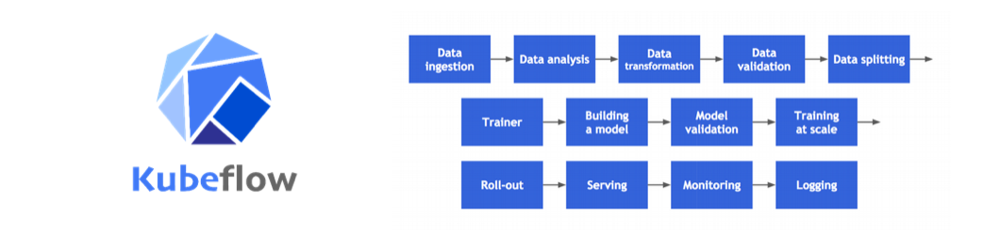
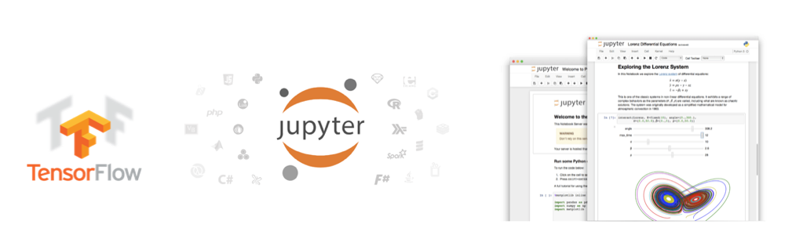
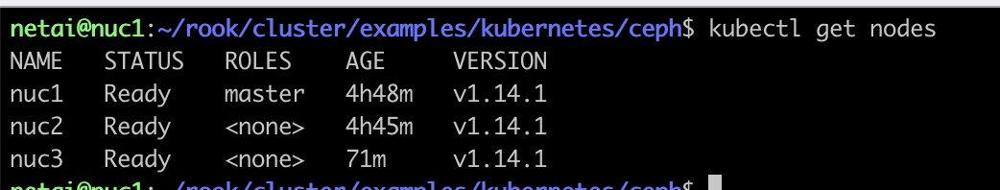

# Lab#6. Analytics Lab

## 0. Objective

Deploy `Machine Learning` workflows on Kubernetes Cluster with `Kubeflow` project. Then, we can run a Sample ML code `MNIST` on Jupyter Notebook that served by kubeflow.

The minimum specification of the latest version of 'kubeflow' exceeds that of NUC. Therefore, we will install a version of _0.7_ that meets the specifications.

## 1. Concept

### 1-1. Kubeflow


The [**Kubeflow**](https://www.kubeflow.org/) project is dedicated to making deployments of machine learning (ML) workflows on Kubernetes simple, portable and scalable. Our goal is not to recreate other services, but to provide a straightforward way to deploy best-of-breed open-source systems for ML to diverse infrastructures. Anywhere you are running Kubernetes, you should be able to run Kubeflow.

### 1-2. TensorFlow & Jupyter Notebook


[**TensorFlow**](https://github.com/tensorflow/tensorflow) is an open-source machine learning library for research and production. TensorFlow offers APIs for beginners and experts to develop for desktop, mobile, web, and cloud.
**Jupyter Notebook** is an open-source web application that allows you to create and share documents that contain live code, equations, visualizations and narrative text. Uses include: data cleaning and transformation, numerical simulation, statistical modeling, data visualization, machine learning, and much more.

### 1-3. MNIST


The **MNIST** database (Modified National Institute of Standards and Technology database) is a large database of handwritten digits that is commonly used for training various image processing systems.[1][2] The database is also widely used for training and testing in the field of machine learning.

## 2. Practice


### 2-1. K8s 클러스터 재설정 작업 진행(re-config K8s cluster)

#### hostname 설정(hostname config)

```shell
# From NUC 1 :
sudo hostname nuc01
# From NUC 2 :
sudo hostname nuc02
# From NUC 3 :
sudo hostname nuc03
```

#### swapoff

```shell
# From All NUCs
sudo swapoff -a
sudo sed -e '/\/swapfile/s/^/#/g' -i /etc/fstab
sudo sed -e '/\/swap\.img/s/^/#/g' -i /etc/fstab
```

#### Kubernetes Master Setting(For NUC1)

```shell
# From NUC1
sudo kubeadm reset -f
sudo rm -rf /etc/cni/net.d
sudo ipvsadm --clear
```

```shell
# From NUC1
## Cleanup Rook Configuration
sudo rm -rf /var/lib/rook
sudo kubeadm init --ignore-preflight-errors=all
```

```shell
# From NUC1
## make kubectl work for your non-root user.
rm -r $HOME/.kube
mkdir -p $HOME/.kube
sudo cp -i /etc/kubernetes/admin.conf $HOME/.kube/config
sudo chown $(id -u):$(id -g) $HOME/.kube/config
kubectl taint nodes --all node-role.kubernetes.io/master-
```

#### Kubernetes Worker Setting(For NUC2, NUC3)

```shell
# From NUC2, NUC3
sudo kubeadm reset -f
sudo rm -r /etc/cni/net.d
sudo ipvsadm --clear

## Cleanup Rook Configuration
sudo rm -rf /var/lib/rook
```


```shell
# From NUC2, NUC3
## NUC1의 명령어를 sudo 권한으로 실행(sudo 권한 필수!)
## execute NUC1's command with sudo previlege(sudo previlege required!)
sudo kubeadm join <NUC1 IP>:6443 --token <YOUR TOKEN> --discovery-token-ca-cert-hash <YOUR HASH>
```

```shell
# From NUC1
kubectl apply -f "https://github.com/weaveworks/weave/releases/download/v2.8.1/weave-daemonset-k8s-1.11.yaml"
```

#### Check K8s Cluster status

```shell
# From NUC1 -> check status
kubectl get nodes
kubectl get po -n kube-system -o wide
```



#### 2-2. install kubernetes Dashboard

```shell
# From NUC1
kubectl apply -f https://raw.githubusercontent.com/kubernetes/dashboard/v2.6.1/aio/deploy/recommended.yaml
kubectl proxy
```


if you encounter the error please refer to offical docs
https://kubernetes.io/docs/tasks/access-application-cluster/web-ui-dashboard/
