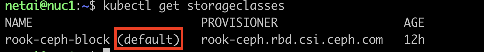
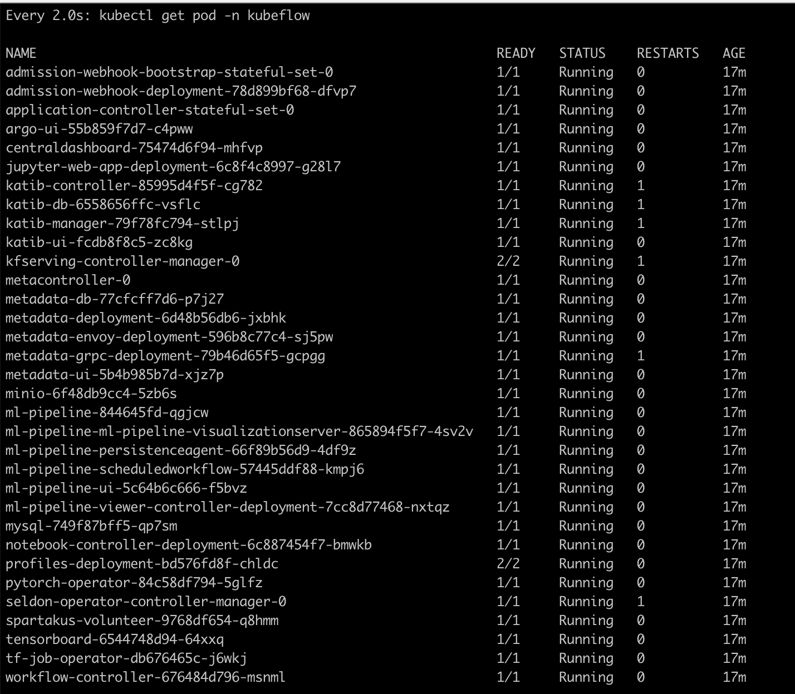
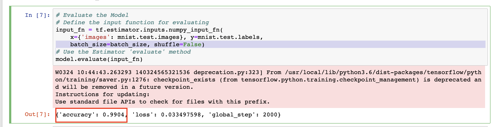

# Lab#6. Analytics Lab

## 0. Objective

Deploy `Machine Learning` workflows on Kubernetes Cluster with `Kubeflow` project. Then, we can run a Sample ML code `MNIST` on Jupyter Notebook that served by kubeflow.

The minimum specification of the latest version of 'kubeflow' exceeds that of NUC. Therefore, we will install a version of _0.7_ that meets the specifications.

## 1. Concept

### 1-1. Kubeflow


The [**Kubeflow**](https://www.kubeflow.org/) project is dedicated to making deployments of machine learning (ML) workflows on Kubernetes simple, portable and scalable. Our goal is not to recreate other services, but to provide a straightforward way to deploy best-of-breed open-source systems for ML to diverse infrastructures. Anywhere you are running Kubernetes, you should be able to run Kubeflow.

### 1-2. TensorFlow & Jupyter Notebook


[**TensorFlow**](https://github.com/tensorflow/tensorflow) is an open-source machine learning library for research and production. TensorFlow offers APIs for beginners and experts to develop for desktop, mobile, web, and cloud.
**Jupyter Notebook** is an open-source web application that allows you to create and share documents that contain live code, equations, visualizations and narrative text. Uses include: data cleaning and transformation, numerical simulation, statistical modeling, data visualization, machine learning, and much more.

### 1-3. MNIST


The **MNIST** database (Modified National Institute of Standards and Technology database) is a large database of handwritten digits that is commonly used for training various image processing systems.[1][2] The database is also widely used for training and testing in the field of machine learning.

## 2. Practice


### 2-1. K8s 클러스터 재설정 작업 진행(re-config K8s cluster)

#### hostname 설정(hostname config)

```shell
# From NUC 1 :
sudo hostname nuc01
# From NUC 2 :
sudo hostname nuc02
# From NUC 3 :
sudo hostname nuc03
```

#### swapoff

```shell
# From All NUCs
sudo swapoff -a
sudo sed -e '/\/swapfile/s/^/#/g' -i /etc/fstab
sudo sed -e '/\/swap\.img/s/^/#/g' -i /etc/fstab
```

#### Kubernetes Master Setting(For NUC1)

```shell
# From NUC1
sudo kubeadm reset -f
sudo rm -rf /etc/cni/net.d
sudo ipvsadm --clear
```

```shell
# From NUC1
## Cleanup Rook Configuration
sudo rm -rf /var/lib/rook
sudo kubeadm init --ignore-preflight-errors=all
```

```shell
# From NUC1
## make kubectl work for your non-root user.
rm -r $HOME/.kube
mkdir -p $HOME/.kube
sudo cp -i /etc/kubernetes/admin.conf $HOME/.kube/config
sudo chown $(id -u):$(id -g) $HOME/.kube/config
kubectl taint nodes --all node-role.kubernetes.io/master-
```

#### Kubernetes Worker Setting(For NUC2, NUC3)

```shell
# From NUC2, NUC3
sudo kubeadm reset -f
sudo rm -r /etc/cni/net.d
sudo ipvsadm --clear

## Cleanup Rook Configuration
sudo rm -rf /var/lib/rook
```


```shell
# From NUC2, NUC3
## NUC1의 명령어를 sudo 권한으로 실행(sudo 권한 필수!)
## execute NUC1's command with sudo previlege(sudo previlege required!)
sudo kubeadm join <NUC1 IP>:6443 --token <YOUR TOKEN> --discovery-token-ca-cert-hash <YOUR HASH>
```

```shell
# From NUC1
kubectl apply -f "https://github.com/weaveworks/weave/releases/download/v2.8.1/weave-daemonset-k8s-1.11.yaml"
```

#### Check K8s Cluster status

```shell
# From NUC1 -> Check Weave works
kubectl get nodes
kubectl get po -n kube-system -o wide
```


#### Install ROOK Storage

```shell
# From NUC1
kubectl create clusterrolebinding permissive-binding \
--clusterrole=cluster-admin \
--user=admin \
--user=kubelet \
--group=system:serviceaccounts
```

```shell
# From NUC1
cd $HOME
git clone --single-branch --branch release-1.2 https://github.com/rook/rook.git
cd $HOME/rook/cluster/examples/kubernetes/ceph
kubectl create -f common.yaml
kubectl create -f operator.yaml
kubectl create -f cluster-test.yaml
```

```shell
watch kubectl get pod -n rook-ceph
```


Check Rook are running healthy on your cluster.

#### Add StorageClass

```shell
# From NUC1
kubectl apply -f csi/rbd/storageclass-test.yaml
kubectl get storageclass
```

### 2-2. Kubeflow Set-up

#### 2-2-1. Set Rook Storageclass to default for kubeflow

```shell
kubectl patch storageclass rook-ceph-block -p '{"metadata":{"annotations":{"storageclass.kubernetes.io/is-default-class":"true"}}}'
```

#### 2-2-2. Check StorageClass

```shell
kubectl get storageclass
```



### 2-3. Kubeflow Install

```shell
# Configuration
export BASE_DIR=$HOME/kubeflow
mkdir -p $BASE_DIR && pushd $BASE_DIR

# Download kfctl
KFCTL_FILE=kfctl_v0.7.1-2-g55f9b2a_linux.tar.gz
wget https://github.com/kubeflow/kfctl/releases/download/v0.7.1/${KFCTL_FILE}
tar -xf $KFCTL_FILE && rm $KFCTL_FILE
sudo mv kfctl /usr/local/bin/kfctl

# Set environment variables
export KF_NAME="my-kubeflow"
export KF_DIR=${BASE_DIR}/${KF_NAME}
export PATH=$PATH:$BASE_DIR
export CONFIG_URI="https://raw.githubusercontent.com/kubeflow/manifests/v0.7-branch/kfdef/kfctl_k8s_istio.0.7.0.yaml"

# Install kubeflow
rm -rf $KF_DIR; mkdir -p $KF_DIR && cd $KF_DIR
kfctl apply -V -f $CONFIG_URI
popd
```

### 2-4. Monitor kubeflow installation

```shell
watch kubectl get pod -n kubeflow
watch kubectl get svc -n istio-system
```

> Wait until all Container Running
>  > 

`ctrl + c` for stop watching

### 2-5. Connect Jupyter hub

#### 2-5-1. Check exposed port for Kubeflow

You can access Kubeflow at this address (In Browser)

> `http://{nuc01_IP}:{PORT}`

Get {Port} by below command

```shell
kubectl -n istio-system get svc istio-ingressgateway -o jsonpath='{.spec.ports[?(@.name=="http2")].nodePort}'
```

### 2-6. Deploy ML Container (MNIST)

#### 2-6-1. Assign NoteBook Server

Open a web browser and enter the Kubeflow address


Select or enter the options as below

- Image: `gcr.io/kubeflow-images-public/tensorflow-1.14.0-notebook-cpu:v0.7.0`
- CPU: `2`
- Memory: `2Gi`


#### 2-6-2. Run MNIST CNN Example

```shell
# NUC1
cd ~
git clone https://github.com/aymericdamien/TensorFlow-Examples.git
```


Now, you will run the MNIST exam
ple code in sample notebook.
Click kernel -> “Restart&Clear Output” button -> “Restart&Run All” button

The training takes a few **minutes** (Wait!!!!!!!!)




Check training results. Your model has 99.04% accuracy!


Your Machine Learning model correctly identified the number in the images!

## 3. Lab Summary

1. How to create ML/DL environment on a container-orchestrated cluster? (Kubeflow, …)
2. How to operate desired ML training by testing selected ML code (i.e., neural networks) over the prepared training data?
3. Do you understand the overall workflow for running ML/DL?

> Thank You for Your Attention Any Questions? -> twkim@smartx.kr
