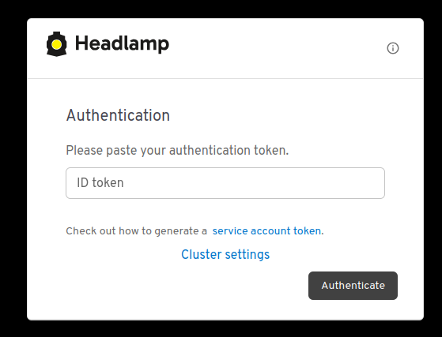
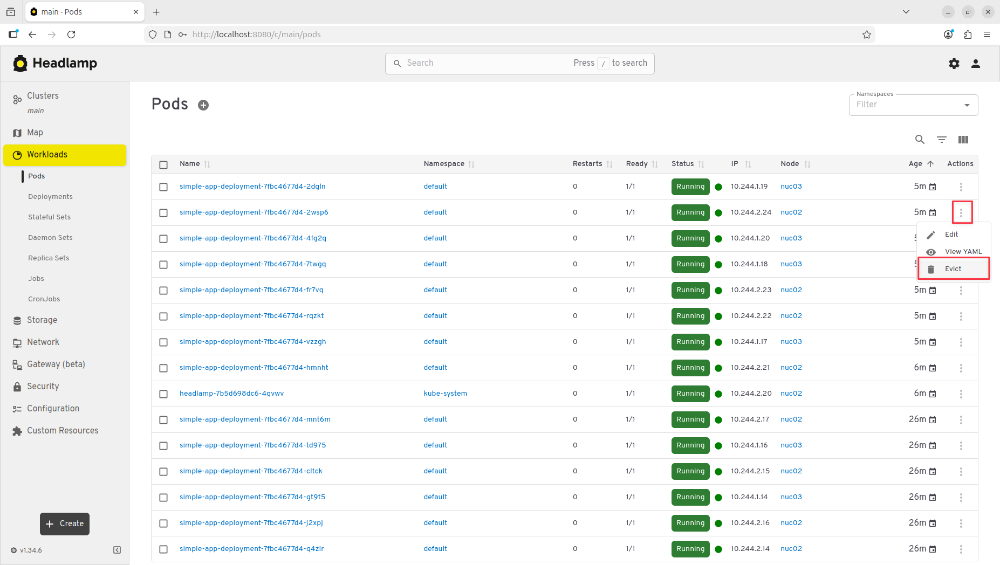
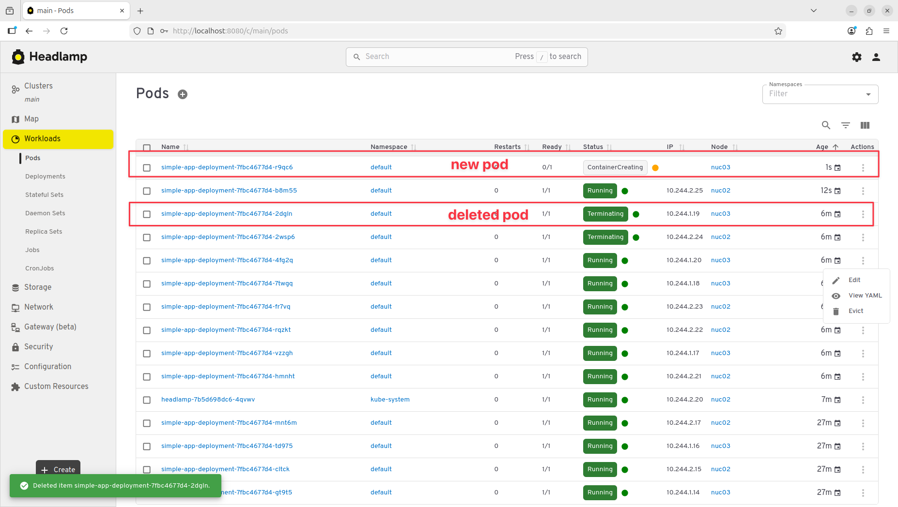
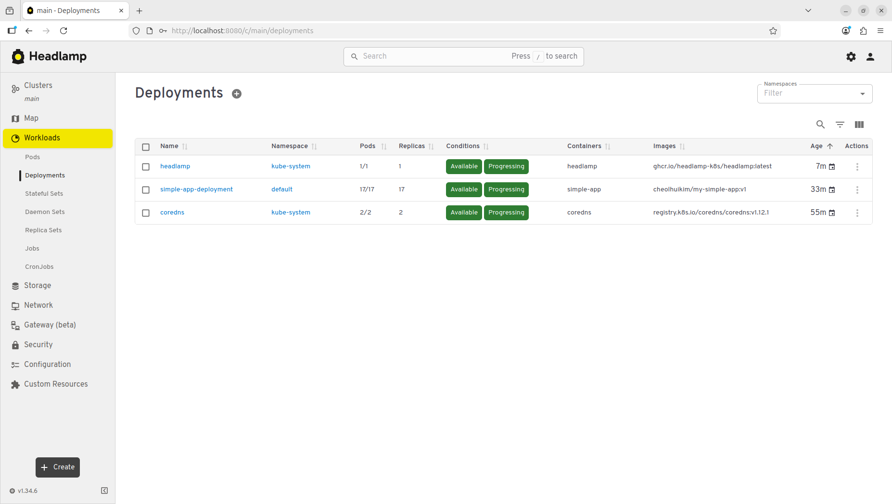
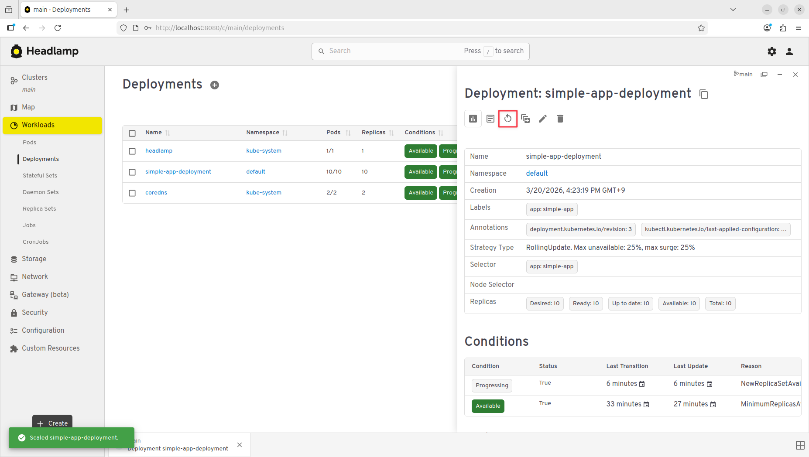
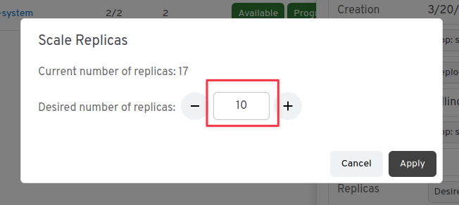
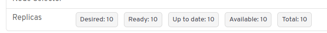
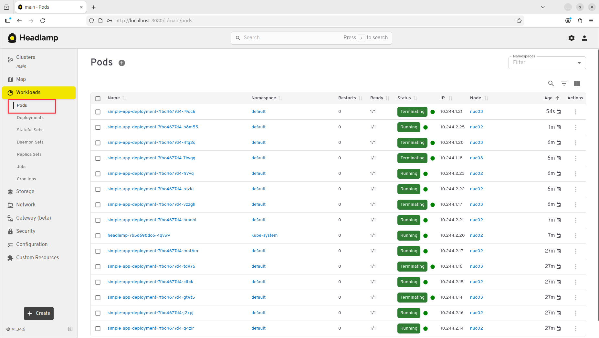
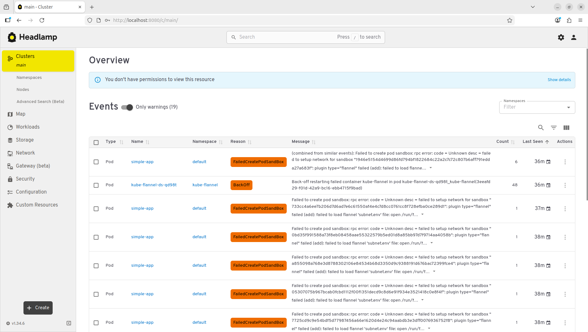
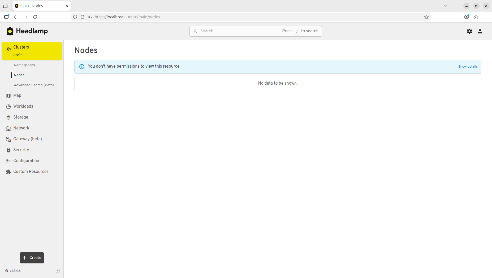

# Lab#6. Analytics Lab

# 0. Objective

In the Lab#4 Tower Lab, we stored the resource status of Raspberry Pi devices into InfluxDB using SNMP, Flume, and Kafka, then visualized and monitored that data using Chronograf dashboards.

In this lab, we will learn how to check and manage the status of Pods, Deployments, Services, and other Kubernetes resources using Headlamp.

## Difference Between `kubectl` and Headlamp

Although Kubernetes clusters can be operated using `kubectl` commands, Headlamp offers a visual interface that makes cluster monitoring and management more intuitive.

The web-based Headlamp is particularly useful for the following reasons:

1. Real-time cluster monitoring: View resource usage and status at a glance.
2. Easy management and debugging: Create, edit, and delete resources with just a few clicks.
3. Better accessibility for non-experts: Even users unfamiliar with `kubectl` can manage Kubernetes with ease.

# 1. Concept

Headlamp is a web-based user interface for Kubernetes.

It simplifies the deployment of containerized applications, debugging, and management of cluster resources.

Examples of actions you can perform include: `Scaling of Deployment`, `Rolling Updates`, `Pod Restarts`, and `Deploying a New Application`.

The Headlamp also provides detailed information on resource status and errors, making it an effective tool for cluster monitoring and maintenance.

&nbsp;

# This lab will be conducted on NUC1

&nbsp;

# 2. Practice

## 2-1. Check Kubernetes Cluster Status

```shell
kubectl get nodes
kubectl get po -n kube-system -o wide
```

When you run the above commands, you should see all **nodes** in a `Ready` state and all **kube-system** Pods in a `Running` state, as shown in the screenshot below:


# 2-2. Install the Headlamp

Run the following commands to install the Headlamp and start a temporary proxy server.

```shell
kubectl apply -f https://raw.githubusercontent.com/kubernetes-sigs/headlamp/main/kubernetes-headlamp.yaml
kubectl port-forward -n kube-system service/headlamp 8080:80
```

&nbsp;

> [!note]
>
> **What is `kubectl port-forward`?**
>
> `kubectl port-forward` lets you access the service inside the cluster from your local machine.
>
> Since the Headlamp runs **inside the cluster**, it is not directly accessible from outside.
>
> Running `kubectl port-forward` allows you to securely access the Headlamp via your browser with **without extra network configuration**.

Once the port-forward is running, open a **new terminal** to continue the next steps.

> [!tip]
>
> Shortcut to open a new terminal tab: `Ctrl + Shift + T`

## 2-3. Issue a Token to Access the Dashboard

To log in to the Headlamp, you need authentication. This involves creating a `Service Account`, binding it to a `ClusterRole`, and generating a **token**.

The following commands create a `ServiceAccount` named `headlamp-admin`, bind it to the **cluster-admin role**, and generate a token for login.

### Service Account

```shell
kubectl -n kube-system create serviceaccount headlamp-admin
```

### ClusterRoleBinding

This grants the `headlamp-admin` ServiceAccount admin privileges.

```shell
kubectl create clusterrolebinding headlamp-admin --serviceaccount=kube-system:headlamp-admin --clusterrole=admin
```

### Generate Login Token

Now issue a token for the `headlamp-admin` account. You will use this token to log in to the dashboard.

```shell
kubectl create token headlamp-admin -n kube-system
```

If successful, you will see a token output in the terminal like the screenshot below. Copy this token for use in the dashboard login.


## 2-4. Access the Headlamp

Now, access the Headlamp using the following address in your browser:

<http://localhost:8080/>

> [!warning]
>
> ⚠️ If you encounter any issues, make sure `kubectl port-forward` is still running!

&nbsp;

If everything is working correctly, you should see a login screen like the one below. Paste the token you received earlier and click `Authenticate`.



&nbsp;

Upon successful login, you will see the Headlamp interface as shown below.


&nbsp;

> [!warning]
>
> ⚠️ If you run into errors, refer to the official documentation:
>
> <https://headlamp.dev/docs/latest/installation/in-cluster/>

## 2-4. Delete a Pod from the Headlamp

Now let’s delete a currently running Pod using the dashboard. Follow the steps shown in the screenshot below and refresh the browser.



As shown in the next screenshot, the Pod that was evicted is now in the `Terminating` state.

You will also notice that a new Pod has been created. Since these Pods are managed by a `Deployment`, Kubernetes maintains the desired number of `replicas` by automatically creating new Pods.

### 2-4-1. Review: Kubernetes `Self-healing` Feature



You can check the same result via the terminal:

```shell
kubectl get pod
```


## 2-5. Scale a Deployment from the Headlamp

Now let’s perform Deployment scaling just like in the Cluster Lab.

Go to the `Deployments` tab and click `simple-app-deployment`, as shown below.



&nbsp;

Then click the `Scale resources` button in the top right corner.



&nbsp;

Set the number of `replicas` to `10` (or any other number you prefer), and click the `Scale` button.



&nbsp;

You should now see that the number of Pods managed by the Deployment has increased to 10.



&nbsp;

You can check the result both in the `Pods` tab of the dashboard and via the terminal:



&nbsp;

```shell
kubectl get pod
```


## 2-6. Check Cluster Events via the Dashboard

The Headlamp provides real-time visibility into cluster-wide events.

Events include state changes and warnings related to resources like Pods, Deployments, Services, and Nodes. Examples:

- Pod status changes: Create, Scheduling, Terminated, Restarted
- Container errors: CrashLoopBackOff, ImagePullBackOff, OOMKilled (Out of Memory)
- Scheduling issues: Insufficient CPU/Memory, No Nodes Available
- Networking issues: Service connection failures, DNS resolution errors
- Storage issues: PVC binding failures, volume mount errors

These logs are extremely helpful for identifying and debugging issues in your cluster.

&nbsp;

Now go to the `Clusters` tab and browse through the pages.



You can also view error-related events and analyze the cause directly through the dashboard.

## 2-7. Access Node Information via the Dashboard

Let’s try accessing node information.

You may see a screen like this in the `Nodes` tab, indicating that access is forbidden.



### Why Can't We Access Node Information?

Kubernetes restricts access to node information for general ServiceAccounts by default for security.

The error message shown includes the following:

```shell
nodes is forbidden:
User "system:serviceaccount:kubernetes-dashboard:admin-user"
cannot list resource "nodes" in API group ""
at the cluster scope
```

This means the `admin-user` ServiceAccount does not have the necessary permissions to view node data.

#### Kubernetes Security Mechanism

- Node-level access involves sensitive information like status, resource usage, and system configuration.
- Exposing this to unprivileged users could affect the entire cluster.
- Kubernetes enforces this restriction by only allowing users with proper roles to access node information.

To view node information, you must configure additional RoleBinding or ClusterRoleBinding permissions.

# 3. Review

## Lab Summary

In this lab, you learned how to visually monitor and manage cluster resources using the Headlamp.

You practiced managing Pods, Deployments, and Services through the GUI and explored how to view cluster event logs.

You also compared `kubectl` CLI-based operation with the dashboard, discovering the advantages of a GUI-based Kubernetes interface.

## Do We Need a Dashboard in Container Orchestration?

In a container orchestration environment, the dashboard is a powerful tool that enhances **operational efficiency and visibility**.

Although all tasks can be performed using **CLI tools like kubectl**, the dashboard provides a more intuitive way to monitor and manage clusters.

Here’s why the dashboard is essential:

1. **Real-Time Visualization of Cluster Status**
   - Unlike CLI outputs, the dashboard allows you to see CPU/memory usage and Pod statuses without extra commands.
2. **Easier Management and Debugging**
   - With kubectl, you must combine multiple commands to check logs and events.
   - The dashboard provides direct access to error messages and events.
3. **Improved Accessibility for Non-Experts**
   - Operations teams or DevOps engineers who aren’t developers can still monitor and manage clusters.
   - However, granting access to non-experts should be done with caution.

In short, the dashboard is a **critical tool** for enhancing Kubernetes cluster management, especially when CLI alone isn't sufficient.

## Key Activities Summary

1. Installed and Accessed the Headlamp
   - Used `kubectl apply` to deploy the dashboard, then accessed it via `kubectl proxy`.

2. Logged into the Dashboard with an Auth Token
   - Created a `ServiceAccount` and `ClusterRoleBinding` for the admin-user, issued a login token, and authenticated.

3. Practiced Resource Management via the Dashboard
   - Deleted Pods: Observed the `Self-healing` behavior via Deployment auto-recovery
   - Scaled Deployments: Changed replica counts dynamically

4. Viewed Cluster Event Logs
   - Explored the Events tab for logs related to Pods, Deployments, Services, and more

5. Observed Access Restrictions for Node Information
   - Learned that node access is restricted by default
   - Understood Kubernetes’ security model and the need for explicit permissions
